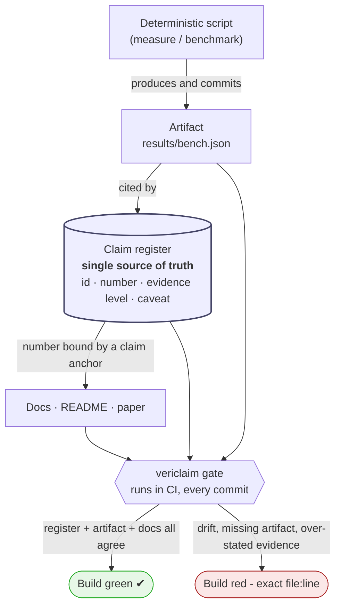

# vericlaim

[](https://github.com/darklordVirtual/vericlaim/actions/workflows/claim-gate.yml)
[](LICENSE)
[](pyproject.toml)

> **Your docs can never quietly disagree with your evidence again.**

vericlaim checks, on every commit, that every number and capability your project
claims about itself is backed by a committed artifact — and that your README,
docs, and papers all still say the same thing. It is **Design by Contract for the
whole repository**, built for the age of AI-authored code, where prose and
numbers drift silently.

Zero runtime dependencies · Python 3.11+ · one command to adopt.

---

## How it works

One picture. A **claim register** is the single source of truth. Each claim is
backed by a committed **artifact** (produced by a deterministic script, never
typed by hand). Your **docs** quote the numbers through small anchors that bind
them to the register. The **gate** runs in CI and fails the build the moment any
of the three drift apart.



**Read it as a rule:** *no claim without an artifact; no doc number that isn't
bound to the register; no claim described above the evidence it has.* All three,
enforced automatically.

---

## Why it exists

AI writes code and prose fast, and forgets what was true yesterday. Numbers in
the README stop matching the paper; a corrected claim reappears in its old form
three files away; a citation is invented. **Testing catches misbehaving code.
Nothing conventional catches a project that misdescribes itself.**

Where Bertrand Meyer's **Design by Contract** put pre/post-conditions on
*functions*, checked at *run time*, vericlaim puts contracts on the *project's
claims about itself*, checked in *CI*. Same discipline, lifted a level, for a new
era. The full argument: [`docs/manifesto.md`](docs/manifesto.md) (5-minute read).

---

## Quickstart (60 seconds)

```bash
pip install vericlaim        # or copy the zero-dependency vericlaim/ folder in
cd your-project
vericlaim init               # scaffolds config + register + baseline; overwrites nothing
vericlaim                    # runs the gate — a fresh project passes immediately
```

Then make your first claim in three small edits:

**1. Register the number** — `claims/register.yaml`:
```yaml
claims:
  - id: CLAIM-PERF-001
    statement: "The parser handles the 10k-line fixture under 200 ms."
    evidence_level: benchmarked
    artifact: [results/parse_bench.json]   # a committed file that proves it
    metrics: { p95_ms: 180 }
    caveat: "CI hardware, single fixture; not a guarantee under load."
```

**2. Bind a doc to it** — in any file matched by `doc_globs`:
```markdown
<!-- claim:CLAIM-PERF-001 p95_ms -->
The parser runs the 10k-line fixture with a p95 latency of **180 ms**.
```

**3. Run the gate** — `vericlaim`. Green. Now change `180` to `190` in the doc
only and run it again: it **fails with the exact file:line**. That is the entire
product.

Full walkthrough: [`docs/getting-started.md`](docs/getting-started.md).

---

## What the gate checks

| Check | Guarantee |
|-------|-----------|
| **Artifact existence** | Every file a claim cites is committed — *no claim without an artifact.* |
| **Register integrity** | Required fields present, valid evidence level, no duplicate ids. |
| **Manifest hashes** | Result artifacts match their SHA-256 — a silently edited number is caught. |
| **Doc binding** | Claim anchors tie prose numbers to the register; drift fails the build. |
| **Evidence levels** | A doc cannot describe a claim above the level it has earned. |
| **Stale-string denylist** | A wording you corrected can never quietly reappear. |

Adoption is **incremental**: pre-existing violations are grandfathered in a
baseline (reported as warnings); new violations fail immediately.

---

## Worked examples — three claim shapes, three domains

Claims are not just benchmark numbers. The [`examples/`](examples/) gallery shows
the same discipline for three different kinds of assertion, smallest first:

| Example | Claim shape | Claim |
|---------|-------------|-------|
| [`greetings/`](examples/greetings/) | **capability count** | supports 6 languages |
| [`tipcalc/`](examples/tipcalc/) | **correctness** | all 12 reference cases pass |
| [`rle/`](examples/rle/) | **benchmark ratio** | 8.0584× compression, lossless |

Each is tiny: a small library, a deterministic script that writes an artifact, a
registered claim, and a doc bound by an anchor. For instance, the compression
one:

<!-- claim:CLAIM-EX-001 overall_ratio -->
A run-length encoder achieves **8.0584×** overall compression on a fixed corpus,
registered as `CLAIM-EX-001`, backed by
[`examples/rle/artifacts/rle_bench.json`](examples/rle/artifacts/rle_bench.json),
and bound to [`examples/rle/docs/results.md`](examples/rle/docs/results.md). Edit
`8.0584` in either the doc or the register without the other, and the gate fails.

---

## Explore this repo (it dogfoods itself)

```bash
git clone https://github.com/darklordVirtual/vericlaim && cd vericlaim
python -m vericlaim           # the gate, run on vericlaim's own claims
python examples/rle/bench.py  # regenerate the example's evidence artifact
pytest -q                     # tests, including the drift-detection guarantee
```

## Layout

```
vericlaim/            the zero-dependency gate (register parser, checks, CLI)
claims/               register.yaml (source of truth) · baseline.json · manifest.md
docs/                 manifesto · getting-started · register spec · evidence levels
examples/             three tiny worked examples (capability, correctness, benchmark)
tests/                tests for the gate and the example
.claude/skills/       a Claude skill that enforces the discipline while you work
.github/workflows/    claim-gate.yml — the gate in CI
vericlaim.toml        gate configuration
```

## Claude skill

This repo ships a Claude skill at
[`.claude/skills/claim-oriented-programming/`](.claude/skills/claim-oriented-programming/SKILL.md).
When Claude works in a project that uses vericlaim, the skill makes it follow the
discipline automatically: produce evidence first, register every number as an
artifact-backed claim, bind docs with anchors, run the gate, and never state a
figure it cannot source.

## Citation

Claim-Oriented Programming and vericlaim are by **Stian Skogbrott**. Please cite
it — see [`CITATION.cff`](CITATION.cff) (GitHub renders a "Cite this repository"
button from it):

> Skogbrott, S. (2026). *vericlaim: A Claim-Oriented Programming gate* (v0.1.0).
> https://github.com/darklordVirtual/vericlaim

## License

Apache-2.0. See [LICENSE](LICENSE). Author: Stian Skogbrott.
