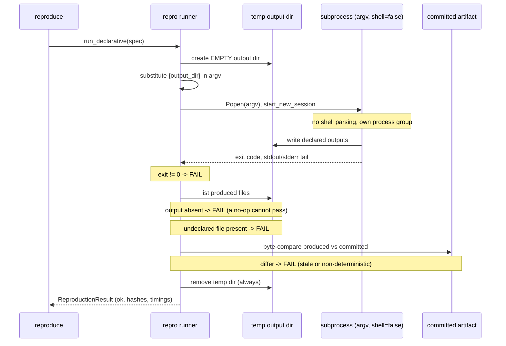

# Diagram: Reproduction sandbox sequence

**Purpose.** Show how the declarative reproduce runner proves an output is
re-created *from scratch*. One question: *why can't a no-op pass?*

**Assumptions.** The register is trusted (same trust as the test suite). The
runner isolates OUTPUTS and blocks shell parsing; it does not sandbox the OS —
see the reproduction model for that honest limit.

**Legend.** Solid arrow = call/return; note = a fail-closed decision point.

**Narrative (alt-text).** `reproduce` calls the runner, which creates an EMPTY
temporary output directory and substitutes `{output_dir}` into the argv. The
command runs as a real subprocess with `shell=False` in its own process group (so
a timeout kills the whole group). It must write its declared outputs into the
empty directory. The runner then fails closed at three gates: a non-zero exit
fails; a declared output that is absent fails — this is why a no-op cannot pass,
because there is no stale file to fall back on; and an undeclared file in the
directory fails. Finally it byte-compares each produced output to the committed
artifact — any difference (a stale committed number or a non-deterministic
script) fails. The temporary directory is always removed, and a machine-readable
result records the outcome.
