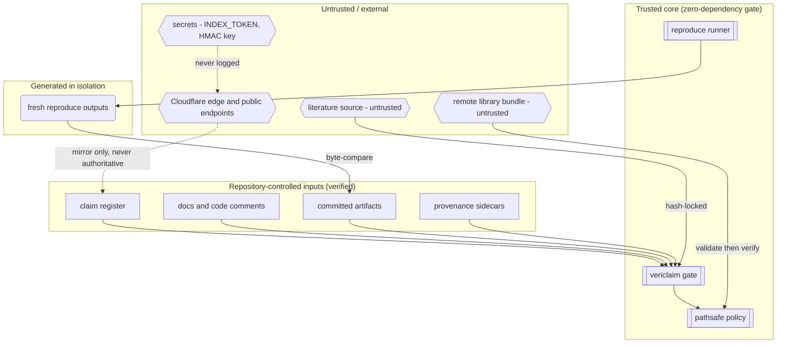

# Diagram: Trust boundaries

**Purpose.** Show what the vericlaim core *trusts* versus what it *verifies*, and
where the optional integrations sit. One question: *which inputs are untrusted?*

**Assumptions.** The core runs on a developer machine or CI runner the maintainer
controls. Everything crossing a boundary INTO the trusted core is verified, not
trusted.

**Legend.** `[[ ]]` trusted core · `[ ]` repository-controlled input (verified) ·
`( )` generated artifact · `{{ }}` untrusted / external. Untrusted nodes are also
labelled "untrusted" in text — color is never the only signal.

**Narrative (alt-text).** The trusted core (gate, reproduce runner, pathsafe
policy) sits at the top. Repository-controlled inputs — the register, docs,
artifacts, and provenance — flow INTO the gate and are verified, never assumed
correct. The reproduce runner produces fresh outputs in an isolated directory and
byte-compares them to the committed artifacts. Untrusted inputs are isolated at
the bottom: remote bundles pass through the pathsafe policy before any file is
written; literature is hash-locked; the Cloudflare edge is a non-authoritative
mirror (a dashed line — the register is the source of truth); secrets never enter
logs. Every arrow entering the core is a verification step, not a trust
assumption.
