<!--
  A VeriClaim master reference / handbook. This document is a SYNTHESIS: it
  introduces NO primary numbers of its own. Every quantitative statement
  carries an inline citation [ID] that resolves to a registered, gate-verified
  claim (the VeriClaim register or the claims library) or to a hash-locked
  literature work in the canon. The registers are authoritative; if a figure
  here ever disagrees with its cited claim, the claim wins. This file lives
  OUTSIDE doc_globs on purpose — it is a reference work over the registers, not
  a source of primary claims.

  Design intent: readable at two levels at once. Every major concept opens with
  a "▶ In plain terms" line for the newcomer and a "▷ In depth" body for the
  practitioner. Diagrams are Mermaid; if your viewer does not render Mermaid,
  each diagram is preceded by a one-line prose summary.
-->

# The Frontier AI Governance Handbook

### A VeriClaim master reference for AI, governance, enterprise architecture, programming, claim-oriented programming, and frontier research

*One place to look things up. Every quantitative claim is traced to verified
evidence; every concept is explained at two levels — plain enough for a
newcomer, precise enough for an architect. Read it front to back as a course,
or jump to any entry as an encyclopedia.*

> **Status:** living synthesis / handbook · **Authority:** the VeriClaim
> register (`claims/register.yaml`) and the claims library are the source of
> truth · **Citations:** every `[ID]` resolves via the register, the ledger
> (`/ledger/verify`), or the MCP tools (`search_claims`, `ask_research`,
> `get_claim_history`). A companion Norwegian edition lives at
> `frontier-ai-governance-master_NO_nb.md`.

---

## The one-page map

▶ **In plain terms:** this handbook has six parts — the *idea* (why
falsifiable governance), the *method* (claim-oriented programming), the
*knowledge* (the RAG library and verified building blocks), the *rules*
(regulation and standards), the *architecture* (how it plugs into an
enterprise), and the *practice* (how you actually do it day to day).

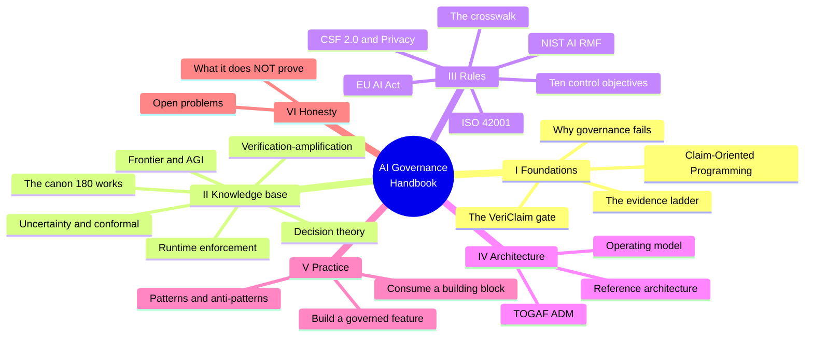

---

## Table of contents

**Part I — Foundations**
1. [Executive summary — the singular insight](#1-executive-summary--the-singular-insight)
2. [What AI governance is, and why most of it fails](#2-what-ai-governance-is-and-why-most-of-it-fails)
3. [Claim-Oriented Programming from first principles](#3-claim-oriented-programming-from-first-principles)
4. [The evidence ladder](#4-the-evidence-ladder)
5. [The VeriClaim gate — what it checks](#5-the-vericlaim-gate--what-it-checks)
6. [The Cloudflare truth layer — RAG, vault, ledger, oracle](#6-the-cloudflare-truth-layer--rag-vault-ledger-oracle)

**Part II — The knowledge base**
7. [The canon: 180 works across 15 collections](#7-the-canon-180-works-across-15-collections)
8. [Building block family 1 — uncertainty and selective prediction](#8-building-block-family-1--uncertainty-and-selective-prediction)
9. [Building block family 2 — verification-amplification](#9-building-block-family-2--verification-amplification)
10. [Building block family 3 — decision theory under uncertainty](#10-building-block-family-3--decision-theory-under-uncertainty)
11. [Building block family 4 — runtime enforcement (REMORA/AROMER)](#11-building-block-family-4--runtime-enforcement-remoraaromer)
12. [Frontier and AGI literature as governance inputs](#12-frontier-and-agi-literature-as-governance-inputs)

**Part III — Rules: regulation and standards**
13. [The regulatory landscape explained](#13-the-regulatory-landscape-explained)
14. [The governance crosswalk (CLAIM-GOV-001)](#14-the-governance-crosswalk-claim-gov-001)
15. [The ten control objectives — reference](#15-the-ten-control-objectives--reference)

**Part IV — Enterprise architecture**
16. [Enterprise architecture primer (TOGAF, Zachman, ArchiMate)](#16-enterprise-architecture-primer-togaf-zachman-archimate)
17. [Placing the building blocks in TOGAF ADM](#17-placing-the-building-blocks-in-togaf-adm)
18. [A reference architecture for a governed AI system](#18-a-reference-architecture-for-a-governed-ai-system)
19. [Operating model, roles and cadence](#19-operating-model-roles-and-cadence)

**Part V — Practice**
20. [How to build a governed AI feature](#20-how-to-build-a-governed-ai-feature)
21. [How to consume a building block](#21-how-to-consume-a-building-block)
22. [Patterns and anti-patterns](#22-patterns-and-anti-patterns)
23. [The assurance argument](#23-the-assurance-argument)

**Part VI — Honesty**
24. [What this does NOT prove](#24-what-this-does-not-prove)
25. [Open problems and honest gaps](#25-open-problems-and-honest-gaps)

**Part VII — Identity, policy and multi-cloud coupling**
26. [Identity, authentication and workload federation](#26-identity-authentication-and-workload-federation)
27. [Policy-as-code and the decision/enforcement split](#27-policy-as-code-and-the-decisionenforcement-split)
28. [Cross-cloud coupling points — the vendor-neutral seams](#28-cross-cloud-coupling-points--the-vendor-neutral-seams)

**Part VIII — Security operations and data protection**
29. [Security operations — keeping the promise](#29-security-operations--keeping-the-promise)
30. [PII scrubbing and data protection](#30-pii-scrubbing-and-data-protection)

**Appendices**
- [A — Collection index](#appendix-a--collection-index)
- [B — Verified-theorem index](#appendix-b--verified-theorem-index)
- [C — Framework crosswalk matrix](#appendix-c--framework-crosswalk-matrix)
- [D — Glossary](#appendix-d--glossary)
- [E — Claim-ID quick reference](#appendix-e--claim-id-quick-reference)
- [F — Reading paths by role](#appendix-f--reading-paths-by-role)

---
---

# Part I — Foundations

## 1. Executive summary — the singular insight

▶ **In plain terms:** most AI governance is a stack of confident sentences in a
PDF. This handbook shows how to make governance *falsifiable* — every claim
tied to evidence a skeptic can check — and argues that falsifiable governance
is categorically stronger than persuasive governance.

▷ **In depth.** When you combine everything in this library — the regulatory
frameworks, the uncertainty theory, the verification mathematics, the runtime
enforcement experiments, and the honest negative results — one thesis emerges:
**governance can be made falsifiable**, and a falsifiable governance program
beats a persuasive one because a hostile reviewer can attack it and *fail to
break it*. Four verified findings compose that thesis:

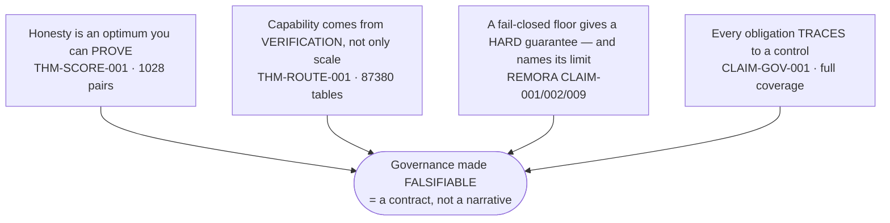

- **Honesty is not a virtue you exhort; it is an optimum you can prove.** A
  proper scoring rule makes truthful probability reporting the unique minimizer
  of expected loss — verified exactly over 1028 (true-distribution,
  alternative-report) pairs [THM-SCORE-001]. Score your components on
  calibration and you *mechanically* reward honesty.
- **Capability comes from verification, not only from scale.** A verifier-gated
  cascade lets a cheap generator plus a selective check dominate a monolith on
  cost/accuracy — over 87 380 exhaustive routing tables [THM-ROUTE-001] — with
  the majority-vote amplification proven *and* its honest converse (voting
  *degrades* a worse-than-chance voter) proven too [THM-VOTE-002].
- **A fail-closed policy floor delivers a hard safety guarantee — and the same
  evidence base names its limit.** REMORA's gate produced a **0.0%** unsafe-
  execution rate on a 700-task adversarial benchmark vs 10–20% for heuristics
  [REMORA CLAIM-001], and blocked **all 208** independent AgentHarm scenarios,
  *externally validated* [REMORA CLAIM-002]. The AROMER negative result honestly
  shows the residual **30.7%** false-accept under neutral metadata [REMORA
  CLAIM-009].
- **Every regulatory obligation traces to a verified control.** 29 elements of
  five regimes map to 10 control objectives with full bidirectional coverage,
  fail-closed [CLAIM-GOV-001].

The combination is the point: uncertainty theory says *when* to abstain; the
verification math says abstention and routing *buy capability*; the runtime
evidence shows a floor *works and where it fails*; the crosswalk shows *which
regulator each control answers*; and the gate makes the whole chain *refuse to
describe itself above its evidence*.

---

## 2. What AI governance is, and why most of it fails

▶ **In plain terms:** governance is the set of rules, roles and checks that
keep an AI system safe, fair, lawful and accountable. Most of it fails because
it is *unfalsifiable* — a document asserts good properties and no one can
mechanically check them.

▷ **In depth.** AI governance answers four questions: *Who is accountable? What
could go wrong? How do we know it is working? What happens when it does not?*
Traditional governance answers these in prose — a policy binder, a model card,
an ethics statement. The failure mode is structural: prose accumulates
*reassurance* without *evidence*. A model card can say "monitored for drift"
whether or not anything monitors anything. An auditor cannot tell a diligent
program from a cosmetic one by reading the document, because both read the same.

The insight this handbook operationalizes is to make each governance assertion
a **claim** with a committed artifact, an evidence level, and a caveat — or to
*refuse to write it*. The refusal is the discipline. A governance program that
cannot quietly accumulate unsupported reassurance is one an auditor can trust.

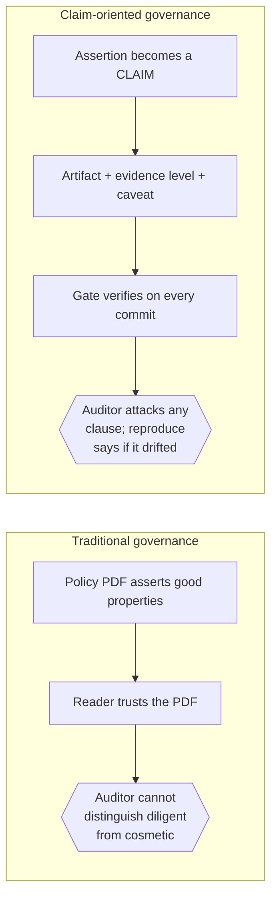

**Why frontier AI raises the stakes.** Frontier systems are agentic (they take
actions through tools), opaque (their reasoning is not directly inspectable),
and fast-moving (capability shifts between releases). Each property defeats a
classic control: agency defeats "review the output" (the action already fired),
opacity defeats "explain the decision" (there is no legible rule), speed
defeats "certify once" (the certified system is already obsolete). The response
is not more prose — it is *runtime* enforcement (Part II, family 4), *selective*
autonomy (families 1–3), and *continuous* verification (the gate, §5).

---

## 3. Claim-Oriented Programming from first principles

▶ **In plain terms:** Claim-Oriented Programming (COP) is Design-by-Contract
raised from a single function to a whole project. A **claim** is a promise
about the system backed by a file on disk, checked automatically. The rule is
simple: *no number without an artifact.*

▷ **In depth.** Design by Contract (Meyer) attaches preconditions,
postconditions and invariants to functions. COP lifts that to the project: any
factual assertion a project makes about *itself* — a benchmark number, a
capability, a compliance property — is a contract between the words and the
evidence, checked in CI by the VeriClaim gate.

**The one rule:**

> No number without an artifact. No doc number that isn't bound to the
> register. No claim described above the evidence it has.

**The STOP reflex.** The instant you are about to type a factual figure, stop:
(1) *What committed artifact establishes this?* (2) *Is it in the register?*
(3) *Does the register value match?* (4) *Does the prose carry the caveat?* Only
if all four pass do you write the sentence. If no artifact exists you have three
honest moves — produce it, register the claim at `theoretical` and say so, or do
not write the number. There is no fourth move.

**The procedure, as a loop:**

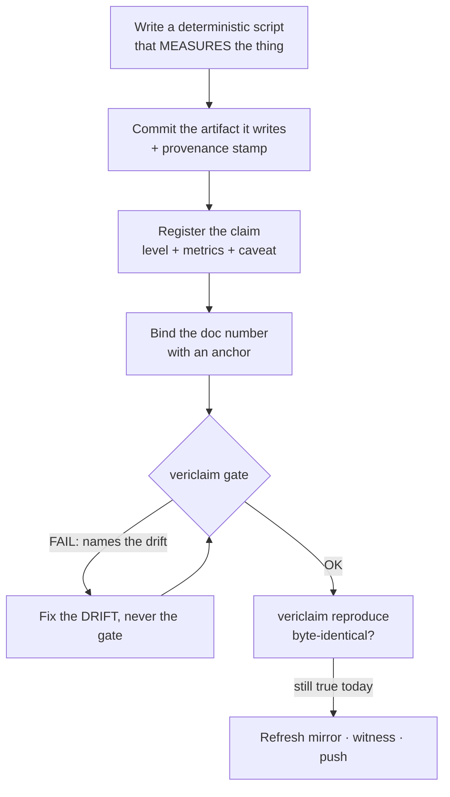

**Worked example (the shape of every claim):**

```yaml
- id: CLAIM-AREA-001
  statement: "One line: what is claimed."
  evidence_level: benchmarked   # see the ladder, §4
  artifact: [results/example.json]
  metrics: { value: 42 }        # the numbers the docs may quote
  caveat: "Scope and limitation — part of the claim, not a footnote."
  reproduce: "python3 bench/example.py"
```

And the doc binding that ties prose to it:

```markdown
<!-- claim:CLAIM-AREA-001 value -->
The measured value is **42** on the reference corpus (a demonstration corpus;
see the register caveat).
```

**Why this is a governance substrate, not just a coding habit.** Every clause
in a governance argument — "policy enforced", "drift monitored", "obligations
mapped" — becomes a claim at a stated evidence level. The governance program
*is* the register. Its trustworthiness is not rhetorical; it is the output of a
gate that refuses drift.

---

## 4. The evidence ladder

▶ **In plain terms:** not all evidence is equal. The ladder is six rungs from
"we argued it" to "an independent party confirmed it". A claim may only be
*described* at the rung it has *earned*.

▷ **In depth.** The ladder, weakest to strongest:

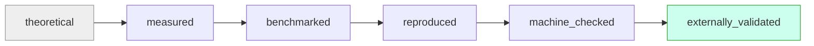

| Rung | Meaning | Example in this library |
|---|---|---|
| **theoretical** | argued from principles or a bibliographic pointer; no measurement | a literature reference [REF-051] |
| **measured** | a deterministic measurement over a committed artifact | the governance crosswalk coverage [CLAIM-GOV-001] |
| **benchmarked** | measured on a defined benchmark with a stated protocol | REMORA's 700-task result [REMORA CLAIM-001] |
| **reproduced** | re-run and byte-identical (`vericlaim reproduce`) | every gate-green claim, on each release |
| **machine_checked** | verified by exhaustive/exact computation | the theorem batteries [THM-ROUTE-001] |
| **externally_validated** | confirmed by an independent party or independent data | AgentHarm dataset-independence [REMORA CLAIM-002] |

Grading is **conservative**: describe a claim only at the level it has earned.
Demotion is always allowed; promotion needs new evidence. This ladder is the
governance program's honesty scale — and the gate enforces it (a doc cannot
describe a claim above its earned level).

> **⚠️ A subtle point.** `machine_checked` is *stronger* than `benchmarked` for
> the property it covers, but it covers a *smaller* property — an exact math
> fact on bounded instances, not a real-world outcome. `externally_validated`
> is the strongest *worldly* rung. Neither dominates the other across all
> questions; read what each claim actually covers.

---

## 5. The VeriClaim gate — what it checks

▶ **In plain terms:** the gate is an automatic checker that runs on every
commit and refuses to let the project's words outrun its evidence.

▷ **In depth.** The default gate is side-effect-free and checks nine things:

```mermaid
flowchart TB
    subgraph Gate["vericlaim (every commit) — fail-closed"]
        G1[1 Register integrity<br/>fail-closed parse] --> G2[2 Artifact existence]
        G2 --> G3[3 Path containment<br/>no .. no absolute no symlink escape]
        G3 --> G4[4 Provenance sidecars<br/>how each artifact was made]
        G4 --> G5[5 Manifest hashes<br/>SHA-256 match]
        G5 --> G6[6 Doc binding<br/>prose + code comments to register]
        G6 --> G7[7 Evidence-level honesty]
        G7 --> G8[8 Stale-string suppression]
        G8 --> G9[9 Literature integrity<br/>source still hashes to registered SHA]
    end
    Gate --> OK{{[OK] or names the exact<br/>file:line that drifted}}
```

A separate command, `vericlaim reproduce`, *executes* each evidence script and
fails unless the artifact is byte-identical — the number is *still true today*.

**What the gate proves — and does not.** It proves *internal consistency and
reproducibility*. It does **not** prove a benchmark is production-realistic,
that evidence was not manipulated before commit, that `externally_validated`
was truly external, or that a *sentence* is correct — doc binding proves a
number is **present and register-matched**, not that the surrounding prose is
true. Staying inside that boundary is itself part of the discipline (§24).

---

## 6. The Cloudflare truth layer — RAG, vault, ledger, oracle

▶ **In plain terms:** an optional edge service that turns the register into a
searchable, tamper-evident, hash-chained record — plus a literature RAG that
*refuses* to answer when it has no grounds.

▷ **In depth.** The truth layer mirrors the authoritative register into a
Cloudflare stack and adds a literature RAG. It is strictly *additive*: the
register + gate remain the source of truth; the edge can be stale and never
blocks.

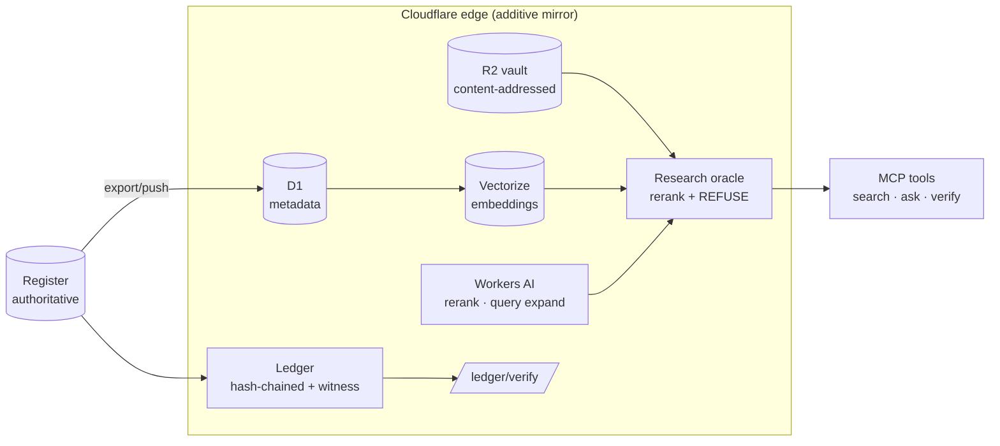

**Three honesty properties:**
1. **Retrieval, never evidence.** Searchability proves a work was registrar-
   verified or honestly snapshotted and hash-locked — *not* that its contents
   are true. Tier travels with every hit.
2. **Refusal at the boundary.** The oracle refuses when no chunk clears the
   relevance bar; the refusal is scored only against *trusted* phrasings of the
   query, so a prompt-injected query cannot manufacture relevance — the
   grounded generator is the authoritative overclaim guard.
3. **Tamper-evidence.** The ledger is append-only and hash-chained; the client
   verifier confirms it has not been rewritten since the first anchor. The
   library ledger currently stands at 1408 entries across 192 verified bundles.

---
---

# Part II — The knowledge base

## 7. The canon: 180 works across 15 collections

▶ **In plain terms:** a curated, hash-locked library of 180 research works and
standards, vectorized so you can ask it questions — and it answers only when it
has grounds.

▷ **In depth.** All scale figures are from the CLAIM-LIB-RAG family:

| Property | Value | Citation |
|---|---|---|
| Canon works | 180 across 15 collections | [CLAIM-LIB-RAG-001] |
| Registrar-verified into the catalog | 171 | [CLAIM-LIB-RAG-001] |
| Documented drops (honest gaps) | 9, with 0 undocumented | [CLAIM-LIB-RAG-001] |
| Content-addressed chunks, all live | 9805 | [CLAIM-LIB-RAG-002] |
| Live research endpoints verified | end-to-end | [CLAIM-LIB-RAG-003] |
| Library ledger entries / bundles | 1408 / 192 | ledger `/summary` |

**How retrieval + refusal actually works** (why you can trust an answer):

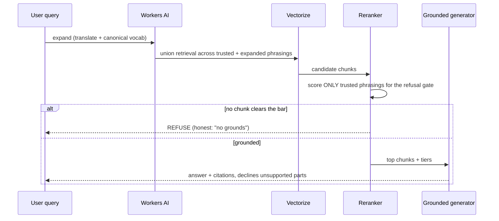

The full collection index is Appendix A. The four verified *building-block*
families (§§8–11) are the reusable, machine-checked core; the literature
(§§12–13) is the context they rest on.

---

## 8. Building block family 1 — uncertainty and selective prediction

▶ **In plain terms:** the math that lets a system *know when it does not know*
and abstain instead of guessing — with a coverage guarantee that holds without
assuming the data's distribution.

▷ **In depth.** Conformal prediction wraps any predictor to output a *set* (or
interval) that contains the truth with a chosen probability, distribution-free
and finite-sample. The exact combinatorics of the coverage guarantee are
machine-checked [THM-CONF-001], and a worked runtime demonstration shows
conformal intervals covering the truth in **373 of 400** rounds (0.9325 against
a 0.9 target) [DEMO-001].

**Why governance needs this.** "The system knows when it does not know" is the
precondition for *selective autonomy*: act when confident, abstain and escalate
when not. It cashes out the EU AI Act Art. 15 accuracy/robustness requirement
and the NIST AI RMF MEASURE function.

> **Newcomer's intuition.** Imagine a weather app that, instead of always
> saying "70% rain", sometimes says "I can't call this one — ask a human". A
> conformal wrapper is the principled version: it is *guaranteed* to be right
> about how often it's right, so its abstentions are trustworthy.

**Honest limit.** The guarantee is *marginal* (over the distribution), not per-
instance; it assumes exchangeable data; and the demonstration [DEMO-001] is one
seeded, deterministic run with a fixed predictor — consistent with the
guarantee, nothing more.

---

## 9. Building block family 2 — verification-amplification

▶ **In plain terms:** checking an answer is often cheaper and more reliable than
producing it — so a cheap producer plus a good checker can beat an expensive
producer. This is *why* "route hard cases to stronger review" works.

▷ **In depth.** Three machine-checked results:

- **Best-of-n is an exact identity.** With n independent attempts each
  succeeding with probability p, the chance at least one succeeds is
  1 − (1−p)ⁿ — verified exactly by enumeration [THM-VOTE-001].
- **Majority vote amplifies — and honestly degrades.** With independent voters
  better than chance, majority accuracy rises toward 1 as you add voters
  (Condorcet); with voters *worse* than chance it falls toward 0. Both
  directions are proven [THM-VOTE-002]. The converse is the honest half most
  treatments omit.
- **Verifier-gated cascades dominate monoliths.** Routing each item to a big
  model only when a cheap verifier is unsure beats always-big and always-small
  on the cost/accuracy frontier — established over 87 380 exhaustive routing
  tables [THM-ROUTE-001].

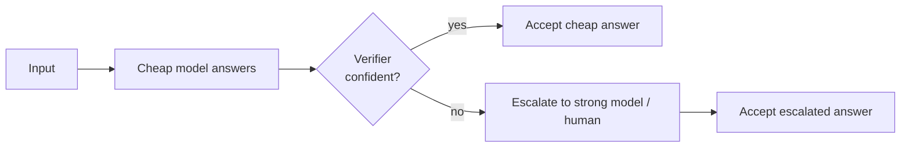

**Why governance needs this.** It is the formal licence for the human-oversight
(Art. 14) and MANAGE (AI RMF) controls: abstain-and-escalate is not a cost
centre, it is on the efficient frontier. It also underwrites the "capability
from verification, not scale" thesis of §1.

---

## 10. Building block family 3 — decision theory under uncertainty

▶ **In plain terms:** the small, exact results behind good decisions —
including the proof that *telling the truth about your confidence is the
optimal strategy*.

▷ **In depth.** Four exact (rational-arithmetic) results:

- **Brier properness — honesty is optimal.** Reporting your *true*
  probabilities uniquely minimizes expected Brier score; every other report
  scores strictly worse — verified over 1028 (true-distribution,
  alternative-report) pairs [THM-SCORE-001]. This is the formal reason a
  calibration-scored program rewards honesty.
- **Secretary optimal stopping.** The optimal explore-then-commit threshold and
  its exact win probability match by DP for every n ≤ 20 [THM-STOP-001].
- **Minimax = maximin.** Every 2×2 integer-payoff zero-sum game has a single
  value both players can secure — over all 6561 games [THM-GAME-001]. This
  underwrites worst-case (adversarial) planning.
- **Jensen / variance ≥ 0.** The inequality behind every expectation bound,
  exact over the grid [THM-JENSEN-001].

> **Why THM-SCORE-001 is the quiet centrepiece.** Governance keeps asking
> people and models to "be honest about uncertainty". Proper scoring turns that
> from an exhortation into an *equilibrium*: under a proper score, the
> uniquely-best move is to say what you actually believe. Build your evaluation
> on a proper score and you have made honesty the dominant strategy.

---

## 11. Building block family 4 — runtime enforcement (REMORA/AROMER)

▶ **In plain terms:** a policy-as-code gate that blocks unsafe agent actions
*before* they run — proven to work, and honest about exactly where it stops
working.

▷ **In depth.** The REMORA-research project supplies the runtime-governance
evidence, gate-verified in its own repository and harvested into the library.

**The floor works.** REMORA's full policy gate produced a **0.0%** unsafe-
execution rate on a 700-task adversarial tool-call benchmark, vs 10–20% for
every heuristic baseline; Wilson 95% CI on false-accept [0.00%, 0.55%] [REMORA
CLAIM-001]. Crucially, the floor comes from **Stage-1 hard-block policy
invariants** — not from the consensus machinery; the claim forbids citing it as
evidence for the consensus layer.

**Externally validated.** On AgentHarm (arxiv:2410.09024), REMORA blocked **all
208** independent harmful scenarios, FAR 0.0%, Wilson [0.00%, 1.81%] — graded
`externally_validated` by dataset independence [REMORA CLAIM-002].

**The limit is published, not hidden.** Under *neutral-looking* trust metadata
(trust=0.70), the structural policy's false-accept rate is **43.0%**
(structural only), falling to **30.7%** after semantic enrichment — a residual
gap requiring runtime execution monitoring [REMORA CLAIM-009]. Marked a NEGATIVE
RESULT that "must NOT be removed or suppressed".

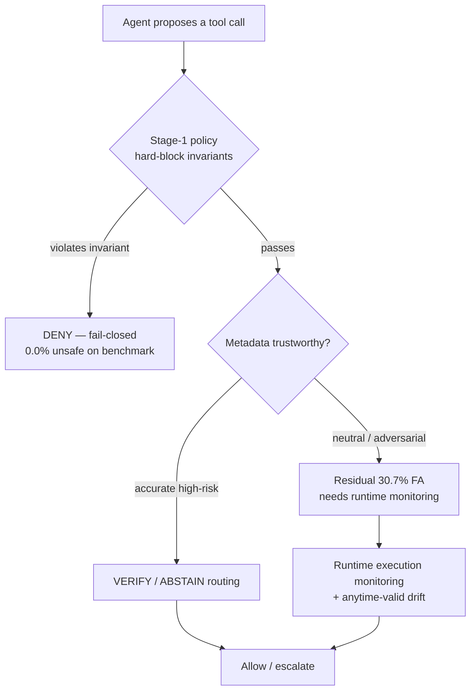

**The composite lesson — a governed claim, not an opinion:** defense-in-depth. A
fail-closed floor is *necessary* for a hard guarantee but *insufficient*
against adversaries supplying benign-looking metadata, so it must be paired with
runtime monitoring and drift detection — exactly the Art. 15 + Art. 14 +
post-market composition the regulatory layer demands, arrived at empirically.

---

## 12. Frontier and AGI literature as governance inputs

▶ **In plain terms:** you cannot govern what you do not understand, so the
library tracks the frontier — reasoning models, agents, world models,
interpretability — and deliberately includes the *skeptical* papers too.

▷ **In depth.** Collection 15 (28 works) is balanced with honest counterpoints:

| Theme | Representative works | Governance relevance |
|---|---|---|
| Reasoning / test-time compute | zero-shot reasoning; DeepSeek-R1 (arxiv:2501.12948); RAP; graph-of-thoughts | risk shifts from training to inference — monitoring must follow |
| Agents | Voyager; generative agents; SWE-agent; AutoGen | autonomous tool-use is the surface REMORA governs — the threat model |
| World models | MuZero; DreamerV3; decision transformer | planning agents internalize objectives — oversight must reach inside the loop |
| Architectures | Mamba/S4; RWKV; ViT; CLIP; Flamingo | long-context + multimodal expand capability *and* attack surface |
| Interpretability | induction heads; representation engineering; influence functions; Platonic hypothesis | make transparency (Art. 13) + oversight (Art. 14) tractable |
| AGI framing + limits | Sparks (arxiv:2303.12712); Levels (arxiv:2311.02462); scalable oversight (arxiv:2211.03540); *"Emergent Abilities a Mirage?"* | the skeptical paper sits next to the AGI-claims paper — same discipline as publishing the AROMER negative result |

The verifiable-claims agenda this whole system operationalizes is itself in the
canon: "Toward Trustworthy AI Development: Mechanisms for Supporting Verifiable
Claims" (arxiv:2004.07213) [REF-051], alongside "Open Problems in Technical AI
Governance" (arxiv:2407.14981) [REF-057].

---
---

# Part III — Rules: regulation and standards

## 13. The regulatory landscape explained

▶ **In plain terms:** a handful of frameworks govern AI. They overlap more than
they differ; the trick is to see them as different *reporting views* of the same
underlying control objectives.

▷ **In depth.** The regimes this handbook maps (canon collections 05–06):

- **NIST AI RMF 1.0** — a *voluntary, risk-based* US framework. Four functions:
  **GOVERN** (culture/accountability), **MAP** (context/risk framing),
  **MEASURE** (analyze/track), **MANAGE** (prioritize/respond). Not a
  checklist — a lifecycle.
- **EU AI Act** — *binding EU law*, risk-tiered. For **high-risk** systems,
  Articles 9–15 require a risk-management system, data governance, technical
  documentation, record-keeping, transparency, human oversight, and
  accuracy/robustness/cybersecurity. This is the most prescriptive regime here.
- **ISO/IEC 42001** — a *certifiable AI management system standard* (like ISO
  27001 for infosec). Plan-Do-Check-Act across clauses 4–10 (context,
  leadership, planning, support, operation, performance evaluation,
  improvement).
- **NIST CSF 2.0** — the *cybersecurity* framework, now with a GOVERN function:
  GOVERN, IDENTIFY, PROTECT, DETECT, RESPOND, RECOVER. AI systems are software
  systems; CSF still applies.
- **NIST Privacy Framework** — privacy-risk companion to CSF: IDENTIFY-P,
  GOVERN-P, CONTROL-P, COMMUNICATE-P, PROTECT-P.
- **GDPR / NIS2** (canon collection 05) — EU data-protection and network/
  information-security law; the legal floor under data governance and
  security.

> **The unifying move.** Rather than run five compliance programs, map all five
> onto one set of **control objectives** and satisfy those. §14 does exactly
> that, with a fail-closed coverage proof.

---

## 14. The governance crosswalk (CLAIM-GOV-001)

▶ **In plain terms:** one map that connects every framework's parts to ten
shared control objectives, with a checker that *refuses to compile* if any part
is unmapped or any objective uncovered.

▷ **In depth.** [CLAIM-GOV-001] encodes the public top-level structure of five
regimes (29 elements) and maps them to 10 shared control objectives via 42
edges, verified for **full bidirectional coverage** — no orphan element, no
uncovered objective, every objective demanded by ≥2 frameworks — fail-closed.

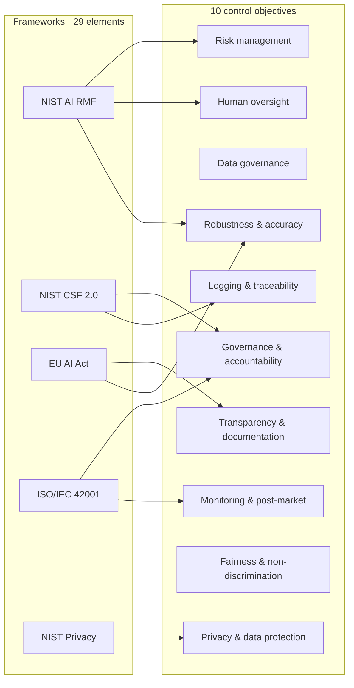

*(The diagram shows representative edges; the complete 42-edge matrix is
Appendix C.)*

**What it is / is not.** A reusable traceability building block a project
vendors to see which objectives each regime demands and check its own control
set — **not** legal advice, **not** certification, **not** proof any control is
correctly implemented. Article/clause specifics below the top level are out of
scope. That boundary is part of the claim.

---

## 15. The ten control objectives — reference

For each objective: a plain definition, which frameworks demand it (from the
fail-closed crosswalk [CLAIM-GOV-001]), which VeriClaim building block
operationalizes it, and the honest evidence level.

### 15.1 Governance & accountability
Defined roles, responsibility, oversight. *Frameworks:* AI RMF GOVERN, CSF
GOVERN, ISO context/leadership/support, Privacy GOVERN-P. *Operationalized by:*
the register + ledger as the accountable record. *Level:* measured.

### 15.2 Risk management
Identify, assess, treat AI risks. *Frameworks:* AI RMF GOVERN/MAP/MANAGE, CSF
IDENTIFY, EU risk-management-system, ISO planning. *Operationalized by:*
verifier-gated routing [THM-ROUTE-001] + conformal abstention [THM-CONF-001].
*Level:* machine_checked (math) / benchmarked (application).

### 15.3 Data governance
Data quality, provenance, bias. *Frameworks:* AI RMF MAP, CSF IDENTIFY, EU
data-governance, Privacy IDENTIFY-P. *Operationalized by:* provenance/supply-
chain collection (07) + content-addressed vault. *Level:* measured.

### 15.4 Transparency & documentation
System/model documentation and disclosure. *Frameworks:* AI RMF MAP, EU
tech-doc/transparency, Privacy COMMUNICATE-P. *Operationalized by:* claim
caveats + evidence levels + the doc-binding gate. *Level:* measured.

### 15.5 Human oversight
Meaningful human control and intervention. *Frameworks:* AI RMF MANAGE, EU
human-oversight, ISO operation. *Operationalized by:* verifier-gated escalation
[THM-ROUTE-001]; REMORA VERIFY/ABSTAIN routing. *Level:* machine_checked /
benchmarked.

### 15.6 Robustness & accuracy
Performance, robustness, security of the AI. *Frameworks:* AI RMF MEASURE, CSF
PROTECT, EU accuracy/robustness, ISO operation. *Operationalized by:* the
fail-closed policy floor [REMORA CLAIM-001/002]. *Level:* benchmarked /
externally_validated.

### 15.7 Logging & traceability
Records, audit trail, event logging. *Frameworks:* CSF DETECT, EU
record-keeping. *Operationalized by:* the hash-chained witness ledger +
provenance sidecars. *Level:* measured.

### 15.8 Monitoring & post-market
Ongoing monitoring, drift, incident response. *Frameworks:* AI RMF
MEASURE/MANAGE, CSF DETECT/RESPOND/RECOVER, ISO perf-eval/improvement.
*Operationalized by:* `vericlaim reproduce`; anytime-valid monitoring (REMORA
REM-020). *Level:* measured.

### 15.9 Fairness & non-discrimination
Bias assessment, equitable outcomes. *Frameworks:* AI RMF MEASURE, EU
data-governance. *Operationalized by:* the fairness/privacy collection (09).
*Level:* theoretical→measured — **the thinnest rung** (see §25).

### 15.10 Privacy & data protection
Personal-data protection and minimization. *Frameworks:* CSF PROTECT, Privacy
IDENTIFY-P/CONTROL-P/PROTECT-P. *Operationalized by:* the privacy collection
(09) + GDPR/NIS2 literature (05). *Level:* measured.

---
---

# Part IV — Enterprise architecture

## 16. Enterprise architecture primer (TOGAF, Zachman, ArchiMate)

▶ **In plain terms:** enterprise architecture (EA) is the discipline of
designing an organization's systems as a coherent whole. TOGAF is the most
common *method*; Zachman is a *classification grid*; ArchiMate is a *modeling
language*. Governance succeeds when it plugs into whichever the enterprise
already uses.

▷ **In depth.**
- **TOGAF ADM** — the Architecture Development Method, a cycle of phases
  (Preliminary, A–H) with Requirements Management at the centre. It answers
  *how* to develop and govern architecture over time.
- **Zachman Framework** — a 6×6 grid (What/How/Where/Who/When/Why ×
  perspectives). It answers *what artifacts* a complete architecture description
  contains — useful as a completeness checklist.
- **ArchiMate** — a notation with business/application/technology layers. It
  answers *how to draw* the architecture unambiguously.

This handbook maps the VeriClaim building blocks onto **TOGAF ADM** (§17)
because ADM's phase structure aligns naturally with a governance lifecycle, and
its Requirements Management spine maps onto the register.

---

## 17. Placing the building blocks in TOGAF ADM

▶ **In plain terms:** each phase of the standard architecture method gets a
*falsifiable* deliverable instead of a prose one.

▷ **In depth.**

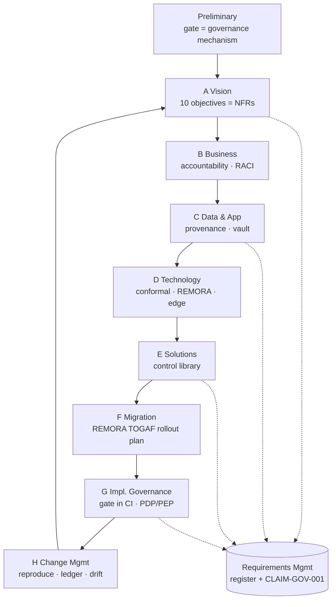

| ADM phase | Governance concern | VeriClaim building block | Framework anchor |
|---|---|---|---|
| **Preliminary** | Establish the capability | The gate as architecture-governance mechanism; the register as requirements repository | ISO 42001 leadership; AI RMF GOVERN |
| **A — Vision** | Risk appetite, objectives | The 10 control objectives [CLAIM-GOV-001] as non-functional requirements | EU AI Act Art. 9; AI RMF MAP |
| **B — Business** | Roles, accountability | `governance_accountability`; RACI over the register | ISO 42001 leadership; CSF GOVERN |
| **C — Data & Application** | Data quality, provenance, docs | Provenance collection (07); content-addressed vault | EU AI Act Art. 10–11 |
| **D — Technology** | Robustness, runtime | Conformal [THM-CONF/DEMO-001]; REMORA [CLAIM-001/002]; the edge | EU AI Act Art. 15; CSF PROTECT |
| **E — Solutions** | Which controls to build | The verified control library (§§8–11) | AI RMF MEASURE/MANAGE |
| **F — Migration** | Rollout sequence | REMORA enterprise TOGAF rollout plan | ISO 42001 planning |
| **G — Impl. Governance** | Enforcement in delivery | Gate in CI; fail-closed PDP/PEP [REMORA CLAIM-001] | EU AI Act Art. 14; CSF DETECT |
| **H — Change Mgmt** | Drift, monitoring | `reproduce`; witness ledger; anytime-valid monitoring | EU AI Act Art. 15; CSF RESPOND/RECOVER |
| **Requirements Mgmt** | Single source of truth | Register + crosswalk | all five regimes |

---

## 18. A reference architecture for a governed AI system

▶ **In plain terms:** the blueprint — data comes in, a model acts, a fail-closed
gate stands between the model and the world, and everything is logged to a
tamper-evident ledger and continuously re-verified.

▷ **In depth.**

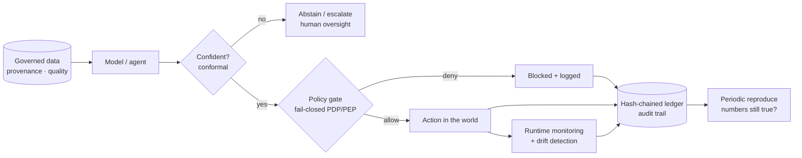

Each element maps to a control objective (§15) and a building block (§§8–11).
The architecture's defining property is that **the gate is in the action path**,
not beside it: an unrecognized action denies by default (fail-closed), and the
denial is itself an audit event.

---

## 19. Operating model, roles and cadence

▶ **In plain terms:** who does what, how often, so the governance stays true
over time rather than rotting into stale documentation.

▷ **In depth.**

| Cadence | Activity | Owner |
|---|---|---|
| **Continuous (CI)** | The gate on every commit; fail-closed | every contributor |
| **Per release** | `reproduce` over the full register; edge mirror refresh; witness | release engineer |
| **Periodic (governance review)** | Re-run crosswalk coverage; review evidence levels for drift/demotion; check the honest-gap list (§25) | accountable governance role (ISO 42001 leadership) |
| **On incident** | The ledger's append-only history is the audit trail; `reproduce` re-establishes which numbers still hold | incident owner |

**RACI, minimal:** the *register* is Accountable to the governance role,
Responsible to every contributor, Consulted with the architecture practice
(TOGAF), and Informed to auditors/regulators via the ledger.

---
---

# Part V — Practice

## 20. How to build a governed AI feature

▶ **In plain terms:** measure first, claim second, write the prose last — and
let the gate catch you if you drift.

▷ **In depth**, as a checklist:

1. **Produce the evidence.** Write a *deterministic* script that measures the
   property; commit the artifact it writes with a provenance stamp.
2. **Register the claim** at its *earned* level, with metrics and a caveat.
3. **Bind any doc number** with a `<!-- claim:ID field -->` anchor.
4. **Run `vericlaim`** — must print `[OK]`; it names any drift by `file:line`.
5. **Run `vericlaim reproduce`** when code a benchmark depends on changed.
6. **Refresh the edge mirror**; for library changes, **witness** and push
   `claims/witness.jsonl`.

> **The reflex that matters most:** when you are about to type a figure and no
> artifact exists — stop. Produce it, or register at `theoretical` and say so,
> or do not write it.

---

## 21. How to consume a building block

▶ **In plain terms:** you can reuse a verified control from the library without
re-deriving it — and you inherit its honesty (level + caveat) unchanged.

▷ **In depth.** `fetch_bundle` → `import_bundle` (offline hash verification) →
`use_code` (byte-exact vendoring with a binding test). A consuming project
inherits the claim's evidence level and caveat; an importer can **demote but
never silently upgrade**. Example targets: the conformal wrapper [THM-CONF],
the verifier-gated router [THM-ROUTE-001], the governance crosswalk
[CLAIM-GOV-001], the decision-theory battery [THM-SCORE/STOP/GAME/JENSEN].

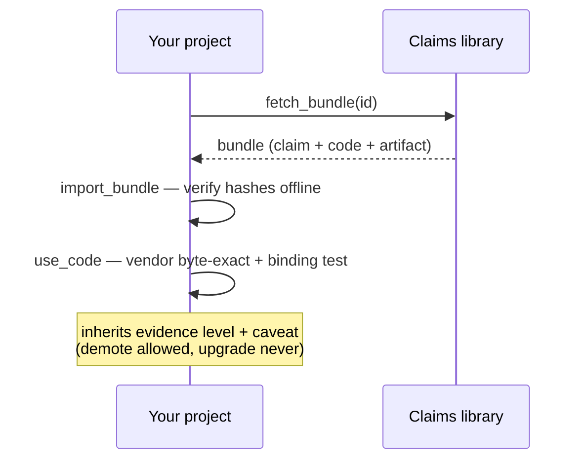

---

## 22. Patterns and anti-patterns

| ✅ Pattern | ❌ Anti-pattern |
|---|---|
| Measure, then claim, then write | "This number is about right" |
| Register the caveat with the number | Quote the number, drop the scope |
| Abstain-and-escalate under uncertainty | Force a confident answer always |
| Fail-closed default (deny the unknown) | Fail-open ("allow unless blocked") |
| Publish the negative result [REMORA CLAIM-009] | Delete results that look bad |
| Grade conservatively; demote when evidence weakens | Silent promotion to a nicer level |
| One set of control objectives, many reporting views | Five parallel compliance binders |
| Fix the drift the gate names | "Work around the gate" |

---

## 23. The assurance argument

▶ **In plain terms:** the whole handbook, compressed into a single claim you
can attack.

▷ **In depth.**

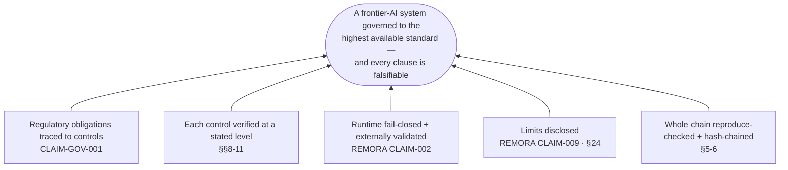

> *A frontier-AI system is governed to the highest available standard when every
> regulatory obligation is traced to a control [CLAIM-GOV-001], each control is
> verified at a stated evidence level (§§8–11), the runtime is fail-closed with
> an externally-validated safety floor [REMORA CLAIM-002] whose limits are
> disclosed [REMORA CLAIM-009], and the entire chain is held in an append-only,
> reproduce-checked, hash-chained register that refuses to describe itself above
> its evidence (§§5–6).*

The assurance case is not "trust this document"; it is "attack any clause — the
gate, the ledger, and the reproduce ritual will tell you if it has drifted".

---
---

# Part VI — Honesty

## 24. What this does NOT prove

▶ **In plain terms:** the reason to trust the strong claims is that the weak
spots are stated just as plainly.

▷ **In depth.**
- **The gate proves consistency and reproducibility, not truth.** Doc binding
  proves a number is *present and register-matched*, not that the sentence is
  correct, the benchmark realistic, or the evidence unmanipulated before commit.
- **The crosswalk is structural, not legal** [CLAIM-GOV-001] — not compliance
  certification; do not present it to a regulator as conformity evidence.
- **Runtime results are simulator-scoped** — REMORA runs no real shell/network/
  DB/file mutations [REMORA CLAIM-001]; the AgentHarm external validity is
  intent-gating, not verified tool-call interception [REMORA CLAIM-002].
- **Machine-checked theorems are bounded instances** — exact within stated
  bounds (87 380 tables [THM-ROUTE-001]; 6561 games [THM-GAME-001]); the general
  asymptotic statements remain literature.
- **Literature citations are bibliographic** — a [REF-NNN] asserts the registrar
  record exists and the extract is hash-locked, nothing about the work's
  correctness.

## 25. Open problems and honest gaps

- **Fairness is the thinnest building block** (§15.9): literature-anchored but
  no machine-checked fairness primitive comparable to the conformal or
  verifier-math batteries. Named, not papered over.
- **Field validation of the runtime floor** is pending — the 0.0% is benchmark-
  scoped [REMORA CLAIM-001]; real-world tool-call interception is future work.
- **The crosswalk stops at top-level structure** — article/clause-level
  traceability is a natural next building block.
- **Human-gated assurance steps** (independent review of the runtime project)
  remain the highest-leverage next step for the strongest evidence rungs.

These define the perimeter; a governance program that knows its own perimeter
is the one worth trusting inside it.

---
---

# Part VII — Identity, policy and multi-cloud coupling

> Governance is only real if it is *enforced* — and enforced the same way
> wherever the system runs. This part connects the abstract control objectives
> (§15) to the concrete seams that carry identity and policy across clouds. Its
> numbers are verified by **CLAIM-COUPLE-001** (`governance/identity_coupling.py`
> in the claims library) and its standards are preserved hash-locked as
> literature under that claim.

## 26. Identity, authentication and workload federation

▶ **In plain terms:** before a system can enforce *what* is allowed, it must
know *who* is asking — whether the "who" is a human logging in or one workload
calling another. The trick that makes this portable is to never ship long-lived
secrets: a workload proves who it is with a short-lived, signed token that every
cloud already understands.

▷ **In depth.** Identity splits into two problems with a shared solution.

**Human authentication** rests on **OAuth 2.0** (RFC 6749 — delegated
authorization) with **OpenID Connect** (OIDC Core 1.0) layered on top to answer
*who authenticated*. An OIDC identity provider issues a signed **ID token** (a
JWT, RFC 7519) whose issuer, audience and expiry a relying party verifies
against a published key set. Lifecycle — joiner/mover/leaver — is carried by
**SCIM 2.0** (RFC 7643/7644), so deactivation propagates as a control, not a
manual chore. **SAML 2.0** remains the incumbent enterprise assertion format and
every major IdP bridges the two.

**Workload identity federation** removes the last static secret. A workload (a
Kubernetes/OpenShift pod, a CI job) presents an OIDC token from a trusted
issuer; the cloud exchanges it — via **OAuth 2.0 Token Exchange** (RFC 8693) —
for a short-lived, narrowly-scoped cloud credential. This is exactly what GCP
Workload Identity Federation, AWS `AssumeRoleWithWebIdentity`/IAM Roles Anywhere,
and Azure federated credentials each implement. Where certificates are the
identity, **mTLS with X.509** (RFC 8705, certificate-bound tokens) and
**SPIFFE/SPIRE** (portable `spiffe://` SVIDs) give the same guarantee for
service-to-service calls.

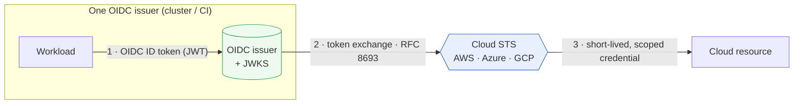

*One issuer, three clouds, the same standard — no distributed static keys. The
security rests on audience restriction, claim conditions and short TTLs; a
mis-scoped trust policy federates more than intended (see the caveat in
CLAIM-COUPLE-001).*

## 27. Policy-as-code and the decision/enforcement split

▶ **In plain terms:** write the rule once, as code, and enforce it identically
everywhere. Separate the part that *decides* ("is this allowed?") from the part
that *enforces* it, so the rule can be tested, versioned and audited like any
other code.

▷ **In depth.** **NIST SP 800-207 (Zero Trust Architecture)** names the shape:
a **Policy Decision Point (PDP)** decides each request from authenticated
identity, context and policy; a **Policy Enforcement Point (PEP)** carries out
the decision at the resource. No implicit trust from network location; every
request is evaluated explicitly and least-privilege.

Policy-as-code fills the PDP. **Open Policy Agent** with the **Rego** language is
the portable substrate: the same Rego runs as a Kubernetes admission controller
(Gatekeeper) on EKS, AKS, GKE and OpenShift, as a service sidecar, and in CI.
**Cedar** (open-sourced, behind Amazon Verified Permissions) offers a
formally-analyzable authorization language for application-level decisions.
**CEL** (Common Expression Language) carries portable conditions (GCP IAM
Conditions, Kubernetes admission). The control-register checks of §15 are
naturally expressed here — a control objective becomes a policy a machine can
evaluate.

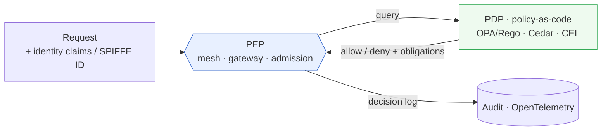

*The PDP identifies nothing and the PEP decides nothing — that separation is
what lets one Rego policy be the governance rule on every platform. A policy is
only as good as its tests and its input; decision logging makes it auditable.*

## 28. Cross-cloud coupling points — the vendor-neutral seams

▶ **In plain terms:** an enterprise rarely lives on one cloud. If governance is
wired with each cloud's proprietary buttons, it has to be rebuilt — and will
drift — on the next cloud. The escape is to couple on the open standards every
cloud already speaks, and treat each cloud's native service as an *adapter*.

▷ **In depth.** CLAIM-COUPLE-001 encodes this as a fail-closed crosswalk: across
**4** clouds (AWS, Azure, GCP, OpenShift) and **6** coupling dimensions, all
**24** cells name a concrete native mechanism and couple on **13** open
standards. The checker enforces the property that makes the seam trustworthy:
**every dimension is anchored by at least one open standard shared across two or
more clouds**, so portability is verified, not asserted.

| Coupling dimension | AWS | Azure | GCP | OpenShift | Portable seam |
|---|---|---|---|---|---|
| Workload identity federation | STS AssumeRoleWithWebIdentity · IAM Roles Anywhere · IRSA | Entra Workload Identity Federation · Managed Identities | Workload Identity Federation | SA projected tokens (OIDC issuer) | OIDC · RFC 8693 · JWT |
| Human authentication | IAM Identity Center · Cognito | Microsoft Entra ID | Cloud Identity | OpenShift OAuth server | OIDC · OAuth2 · SAML2 · SCIM2 |
| Authorization policy | IAM/SCP · Verified Permissions (Cedar) · Gatekeeper | Azure Policy · Gatekeeper on AKS | IAM Conditions (CEL) · Org Policy · Gatekeeper | K8s RBAC · Gatekeeper · Kyverno | Rego/OPA · Cedar · CEL |
| Secrets management | Secrets Manager · Parameter Store | Key Vault | Secret Manager | Secrets + CSI driver · cert-manager | OIDC · mTLS/X.509 |
| Observability & audit | CloudTrail · ADOT | Azure Monitor · Activity Log | Cloud Audit Logs | K8s audit · OTel Operator | OpenTelemetry · CloudEvents |
| Service-to-service mTLS | Private CA · App Mesh | Istio/OSM on AKS | CA Service · Anthos SM | Service Mesh (Istio) · cert-manager | mTLS/X.509 · SPIFFE |

The thirteen open standards, each preserved hash-locked as literature under
CLAIM-COUPLE-001:

| # | Standard | Coupling role |
|---|---|---|
| 1 | OpenID Connect Core 1.0 | Federated identity via signed ID tokens |
| 2 | OAuth 2.0 (RFC 6749) | Delegated authorization |
| 3 | OAuth 2.0 Token Exchange (RFC 8693) | STS-style workload federation |
| 4 | SAML 2.0 | Enterprise SSO assertions |
| 5 | SCIM 2.0 (RFC 7643/7644) | Cross-domain provisioning |
| 6 | JWT (RFC 7519) | Signed, verifiable claims token |
| 7 | mTLS / X.509 (RFC 8705) | Mutual-TLS client identity, bound tokens |
| 8 | SPIFFE/SPIRE | Portable workload identity (SVID) |
| 9 | Open Policy Agent / Rego | Portable policy-as-code |
| 10 | Cedar | Analyzable authorization language |
| 11 | CEL | Portable condition expressions |
| 12 | OpenTelemetry | Vendor-neutral telemetry & audit export |
| 13 | CloudEvents | Portable event envelope |

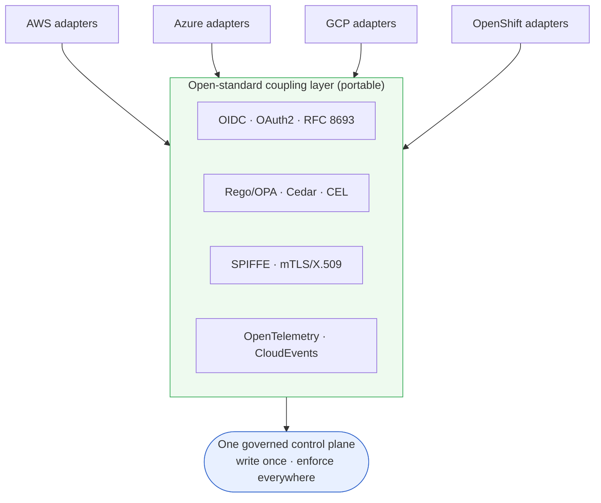

**What this is and is not.** It is an architecture-traceability aid over
publicly documented mechanisms — not a security design review, not a
certification, and not evidence that any deployment is correctly configured.
Native service names are current at authoring time; clouds rename and add
services. The checkable property is internal completeness and cross-cloud
standard-sharing; the standards are the authority. Used honestly, it is the
concrete answer to the vendor-independence requirement of §18–§19: the same
governance, provably portable.

---
---

# Part VIII — Security operations and data protection

> Governance names the promise; security operations *keeps* it, day to day. This
> part gives every control objective an operational home and treats personal
> data as a first-class hazard. Its numbers are verified by **CLAIM-SECOPS-001**
> (`governance/security_operations.py` in the claims library); its standards are
> preserved hash-locked as literature.

## 29. Security operations — keeping the promise

▶ **In plain terms:** a control objective like "we log everything" or "we detect
incidents" is only real if someone actually *runs* the operation behind it —
every day, against a recognized standard. This section maps each operational
domain (service management, observability, logging, vulnerability management,
detection, secrets, resilience) to the practices and standards that keep it.

▷ **In depth.** CLAIM-SECOPS-001 encodes a fail-closed coverage crosswalk:
**8** operational domains name **33** concrete practices run against **13** public
standards, and the checker verifies that every *operational* control objective
has at least one domain that keeps it — so "logging & traceability" is not a
sentence in a policy but a log-management practice against NIST SP 800-92, and
"monitoring & post-market" is observability against NIST SP 800-137 plus
detection mapped to MITRE ATT&CK.

| Domain | Key practices | Standards | Keeps objective |
|---|---|---|---|
| IT service management (ITSM) | Incident · change · problem · SLM | ISO/IEC 20000-1 · ITIL 4 · NIST SP 800-61 | Accountability · monitoring |
| Observability | Metrics · tracing · SLOs · drift detection | OpenTelemetry · NIST SP 800-137 | Monitoring · robustness |
| Logging & audit | Central logs · tamper-evident trail · retention · time-sync | NIST SP 800-92 · ISO/IEC 27001 · OpenTelemetry | Logging & traceability |
| PII data protection | Discovery · scrubbing · minimization · DSAR | ISO/IEC 27701 · GDPR · NIST SP 800-53 | Privacy · data governance |
| Vulnerability management | Scanning · patch SLAs · SBOM · pentest | CIS Controls v8 · OWASP ASVS · NIST SP 800-53 | Robustness · risk |
| Detection & response | SIEM detections · SOAR · IR drills | MITRE ATT&CK · NIST SP 800-61 · CIS v8 | Monitoring · human oversight |
| Secrets & key management | Rotation · HSM-backed keys · short-lived creds | NIST SP 800-53 · CIS v8 | Robustness · accountability |
| Resilience & backup/DR | Immutable backups · restore testing · RTO/RPO | ISO/IEC 27001 · NIST SP 800-53 | Robustness · risk |

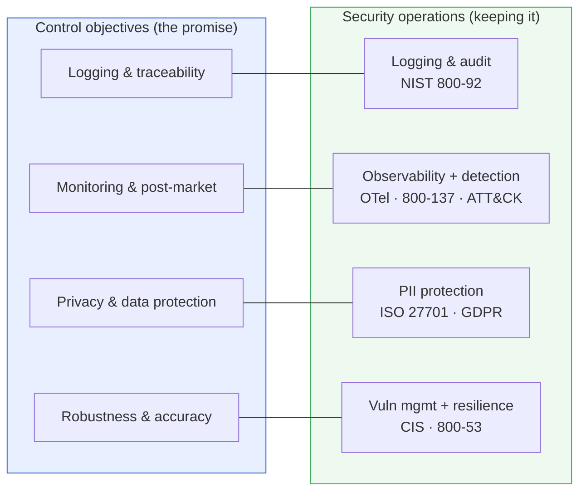

*Four objectives — transparency, human oversight, fairness, and accountability —
are governance/disclosure themes owned by the control register (§15), not
operational domains; the crosswalk states that exclusion explicitly rather than
pretending every objective is an ops task.*

## 30. PII scrubbing and data protection

▶ **In plain terms:** personal data is radioactive — useful, but dangerous if it
leaks into logs, prompts, or a model's memory. Treat it as a hazard with its own
pipeline: find it, remove or mask it before it is stored or sent to a model, keep
only what you must, and honor people's rights over it.

▷ **In depth.** For an AI system, PII enters through prompts, retrieved context,
and logs — three surfaces a traditional data-protection program often misses. A
defensible pipeline runs, in order: **discovery and classification** (know where
PII is), **scrubbing/redaction or pseudonymization** before storage or model
input, **minimization and retention** (keep the least, for the shortest time),
and **data-subject rights** (DSAR, deletion). ISO/IEC 27701 extends an ISO 27001
ISMS into a privacy management system mapped to **GDPR**; NIST SP 800-53 supplies
the detailed privacy controls.

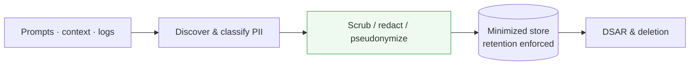

*Redaction is best-effort and must be tested against realistic data;
pseudonymization is not anonymization, and telemetry/logs are a common leak path
(§29's logging domain and this one share responsibility). The honest posture:
minimize what you collect so the scrubbing pipeline has less to catch.*

---
---

# Appendices

## Appendix A — collection index

180 canon works across 15 collections [CLAIM-LIB-RAG-001]:

| # | Collection | Works |
|---|---|---|
| 01 | Uncertainty and routing | 13 |
| 02 | LLM and agent architectures | 19 |
| 03 | Evaluation and calibration | 11 |
| 04 | Agent security | 12 |
| 05 | AI governance | 18 |
| 06 | MLOps and enterprise architecture | 13 |
| 07 | Provenance and supply chain | 12 |
| 08 | Formal methods | 7 |
| 09 | Fairness, privacy and human impact | 9 |
| 10 | Assurance cases and runtime verification | 3 |
| 11 | ML training and systems | 14 |
| 12 | Software engineering and SaaS | 10 |
| 13 | Marketing and growth | 5 |
| 14 | Finance | 6 |
| 15 | Frontier reasoning and AGI | 28 |

## Appendix B — verified-theorem index

Machine-checked building blocks (claims library, `machine_checked` unless
noted), grouped by family:

- **Uncertainty:** conformal combinatorics [THM-CONF-001..004]; runtime
  demonstration [DEMO-001, benchmarked].
- **Verification-amplification:** best-of-n identity [THM-VOTE-001]; majority
  amplification + honest degradation [THM-VOTE-002]; verifier-gated cascade
  dominance, 87 380 tables [THM-ROUTE-001].
- **Decision theory:** Brier properness [THM-SCORE-001]; secretary stopping
  [THM-STOP-001]; minimax=maximin, 6561 games [THM-GAME-001]; Jensen/variance
  [THM-JENSEN-001].
- **Classical foundations (selected):** Chernoff–Hoeffding [THM-CH-001]; CLT
  demonstration [THM-CLT-001, benchmarked]; Johnson–Lindenstrauss [THM-JL-001];
  KKT [THM-KKT-001]; max-flow/min-cut [THM-MFMC-001]; no-free-lunch
  [THM-NFL-001]; universal approximation [THM-UAT-001]; VC dimension
  [THM-VC-001]; Bayes/posterior [THM-BAYES-001, THM-POST-001]; Lean-verified set
  [THM-LEAN-001..003].

Exact grade and scope live in each claim's register entry; counts above are the
exhaustive-check sizes recorded in the evidence artifacts.

## Appendix C — framework crosswalk matrix

Coverage of the 10 control objectives by the 5 frameworks [CLAIM-GOV-001]:

| Objective | AI RMF | CSF 2.0 | EU AI Act | ISO 42001 | Privacy |
|---|---|---|---|---|---|
| Governance & accountability | GOVERN | GOVERN | — | context/leadership/support | GOVERN-P |
| Risk management | GOVERN/MAP/MANAGE | IDENTIFY | risk-mgmt-system | planning | — |
| Data governance | MAP | IDENTIFY | data-governance | — | IDENTIFY-P |
| Transparency & documentation | MAP | — | tech-doc/transparency | — | COMMUNICATE-P |
| Human oversight | MANAGE | — | human-oversight | operation | — |
| Robustness & accuracy | MEASURE | PROTECT | accuracy/robustness | operation | — |
| Logging & traceability | — | DETECT | record-keeping | — | — |
| Monitoring & post-market | MEASURE/MANAGE | DETECT/RESPOND/RECOVER | — | perf-eval/improvement | — |
| Fairness & non-discrimination | MEASURE | — | data-governance | — | — |
| Privacy & data protection | — | PROTECT | — | — | IDENTIFY-P/CONTROL-P/PROTECT-P |

Verified: 29 elements, 42 edges, no orphan element, no uncovered objective,
every objective covered by ≥2 frameworks, checked fail-closed [CLAIM-GOV-001].

## Appendix D — glossary

- **Claim** — a contract between a stated fact and a committed artifact, checked
  by the gate.
- **Evidence level** — the honesty rung a claim earned: theoretical < measured
  < benchmarked < reproduced < machine_checked < externally_validated.
- **Fail-closed** — the default on any unrecognized input is deny/refuse.
- **Control objective** — one of the 10 shared themes [CLAIM-GOV-001].
- **Canon** — the hash-locked literature catalog (180 works) served as the RAG.
- **Ledger / witness** — the append-only, hash-chained public record of every
  library claim; independently verifiable.
- **Building block** — a reusable, pre-verified claim + code, consumed via
  `import_bundle` / `use_code` with its level and caveat intact.
- **PDP / PEP** — Policy Decision Point / Policy Enforcement Point; the
  fail-closed gate in the action path.
- **TOGAF ADM** — the Architecture Development Method; the phase cycle this
  handbook maps building blocks onto (§17).

## Appendix E — claim-ID quick reference

| ID | What it establishes | Level |
|---|---|---|
| CLAIM-LIB-RAG-001 | 180 canon works / 15 collections / 171 verified / 9 drops | measured |
| CLAIM-LIB-RAG-002 | 9805 content-addressed chunks, all pushed live | measured |
| CLAIM-LIB-RAG-003 | live research endpoints verified end-to-end | measured |
| CLAIM-GOV-001 | 5 frameworks → 10 objectives, full coverage, fail-closed | measured |
| CLAIM-COUPLE-001 | 4 clouds × 6 coupling dimensions → 13 open standards, every seam vendor-neutral, fail-closed | measured |
| CLAIM-SECOPS-001 | 8 security-ops domains × 33 practices → 13 standards, every operational objective has a home, fail-closed | measured |
| THM-SCORE-001 | Brier properness — honesty is optimal (1028 pairs) | machine_checked |
| THM-ROUTE-001 | verifier-gated cascade dominance (87 380 tables) | machine_checked |
| THM-VOTE-001/002 | best-of-n identity; amplification + honest degradation | machine_checked |
| THM-GAME-001 | minimax=maximin (6561 games) | machine_checked |
| THM-STOP-001 | secretary optimal stopping (n ≤ 20) | machine_checked |
| THM-JENSEN-001 | variance ≥ 0 (Jensen) | machine_checked |
| THM-CONF-001 | conformal coverage combinatorics | machine_checked |
| DEMO-001 | conformal runtime demo (373/400, 0.9325 vs 0.9) | benchmarked |
| REMORA CLAIM-001 | 0.0% unsafe on 700-task (Wilson [0.00%,0.55%]) | benchmarked |
| REMORA CLAIM-002 | 208/208 AgentHarm blocked, FAR 0.0% | externally_validated |
| REMORA CLAIM-009 | AROMER negative: 43.0%→30.7% FA under neutral metadata | benchmarked |

## Appendix F — reading paths by role

- **Regulator / auditor:** §13 → §14 → §15 → Appendix C → §24.
- **Enterprise architect:** §16 → §17 → §18 → §19.
- **Researcher / builder:** §3 → §§8–11 → §12 → Appendix B.
- **Newcomer:** §2 → §3 (plain lines only) → §7 → §23, then follow curiosity.
- **Executive:** §1 → §23 → §24 (five minutes, the whole thesis and its
  perimeter).

---

*Compiled as a VeriClaim synthesis / handbook. Every citation resolves to a
registered, gate-verified claim or a hash-locked canon work; the registers are
authoritative. Claim-Oriented Programming and VeriClaim by Stian Skogbrott.*
