<!--
  Et VeriClaim-oppslagsverk / håndbok (norsk bokmål). Dokumentet er en SYNTESE:
  det innfører INGEN egne primærtall. Hver kvantitative påstand bærer en
  inline-sitering [ID] som løses opp mot en registrert, gate-verifisert claim
  (VeriClaim-registeret eller claims-biblioteket) eller mot et hash-låst
  litteraturverk i kanon. Registrene er autoritative; hvis et tall her noen gang
  avviker fra claimen det siterer, vinner claimen. Filen ligger BEVISST utenfor
  doc_globs; den er et oppslagsverk OVER registrene, ikke en kilde til
  primærclaims.

  Designidé: lesbar på to nivåer samtidig. Hvert hovedkonsept åpner med en linje
  "▶ Enkelt forklart" for nykommeren og en "▷ I dybden"-tekst for praktikeren.
  Diagrammer er Mermaid; hvert diagram har en prosa-oppsummering foran.

  English edition: frontier-ai-governance-master.md
-->

# Håndbok i styring av frontier-AI

### Et VeriClaim-oppslagsverk for AI, styring, enterprise-arkitektur, programmering, påstandsbasert programmering og frontier-forskning

*Ett sted å slå opp. Hver kvantitative påstand er sporet til verifisert
evidens; hvert konsept er forklart på to nivåer: enkelt nok for en nykommer,
presist nok for en arkitekt. Les det fra perm til perm som et kurs, eller hopp
til hvilken som helst oppføring som i et leksikon.*

> **Status:** levende syntese / håndbok · **Autoritet:** VeriClaim-registeret
> (`claims/register.yaml`) og påstandsbiblioteket er sannhetens kilde ·
> **Siteringer:** hver `[ID]` løses opp via registeret, hovedboken
> (`/ledger/verify`) eller MCP-verktøyene (`search_claims`, `ask_research`,
> `get_claim_history`). Den engelske utgaven ligger i
> `frontier-ai-governance-master.md`.

---

## Ett-siders kart

▶ **Enkelt forklart:** håndboken har seks deler: *idéen* (hvorfor
falsifiserbar styring), *metoden* (påstandsbasert programmering),
*kunnskapen* (RAG-biblioteket og verifiserte byggesteiner), *reglene*
(regulering og standarder), *arkitekturen* (hvordan det kobles inn i et
enterprise) og *praksisen* (hvordan du faktisk gjør det daglig).

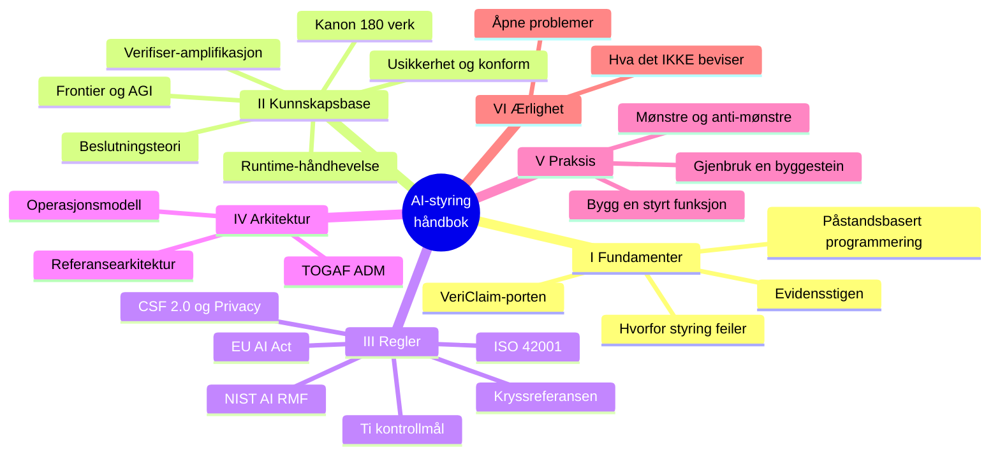

---

## Innholdsfortegnelse

**Del I: Fundamenter**
1. [Sammendrag: den enestående innsikten](#1-sammendrag-den-enestående-innsikten)
2. [Hva AI-styring er, og hvorfor det meste feiler](#2-hva-ai-styring-er-og-hvorfor-det-meste-feiler)
3. [Påstandsbasert programmering fra grunnen](#3-påstandsbasert-programmering-fra-grunnen)
4. [Evidensstigen](#4-evidensstigen)
5. [VeriClaim-porten: hva den sjekker](#5-vericlaim-porten-hva-den-sjekker)
6. [Cloudflare-sannhetslaget: RAG, hvelv, hovedbok, orakel](#6-cloudflare-sannhetslaget-rag-hvelv-hovedbok-orakel)

**Del II: Kunnskapsbasen**
7. [Kanon: 180 verk over 15 kolleksjoner](#7-kanon-180-verk-over-15-kolleksjoner)
8. [Byggestein-familie 1: usikkerhet og selektiv prediksjon](#8-byggestein-familie-1-usikkerhet-og-selektiv-prediksjon)
9. [Byggestein-familie 2: verifiser-amplifikasjon](#9-byggestein-familie-2-verifiser-amplifikasjon)
10. [Byggestein-familie 3: beslutningsteori under usikkerhet](#10-byggestein-familie-3-beslutningsteori-under-usikkerhet)
11. [Byggestein-familie 4: runtime-håndhevelse (REMORA/AROMER)](#11-byggestein-familie-4-runtime-håndhevelse-remoraaromer)
12. [Frontier- og AGI-litteratur som styringsgrunnlag](#12-frontier--og-agi-litteratur-som-styringsgrunnlag)

**Del III. Regler: regulering og standarder**
13. [Det regulatoriske landskapet forklart](#13-det-regulatoriske-landskapet-forklart)
14. [Styringskryssreferansen (CLAIM-GOV-001)](#14-styringskryssreferansen-claim-gov-001)
15. [De ti kontrollmålene: oppslag](#15-de-ti-kontrollmålene-oppslag)

**Del IV: Enterprise-arkitektur**
16. [Enterprise-arkitektur på 5 minutter (TOGAF, Zachman, ArchiMate)](#16-enterprise-arkitektur-på-5-minutter-togaf-zachman-archimate)
17. [Byggesteinene plassert i TOGAF ADM](#17-byggesteinene-plassert-i-togaf-adm)
18. [En referansearkitektur for et styrt AI-system](#18-en-referansearkitektur-for-et-styrt-ai-system)
19. [Operasjonsmodell, roller og kadens](#19-operasjonsmodell-roller-og-kadens)

**Del V: Praksis**
20. [Slik bygger du en styrt AI-funksjon](#20-slik-bygger-du-en-styrt-ai-funksjon)
21. [Slik gjenbruker du en byggestein](#21-slik-gjenbruker-du-en-byggestein)
22. [Mønstre og anti-mønstre](#22-mønstre-og-anti-mønstre)
23. [Assurance-argumentet](#23-assurance-argumentet)

**Del VI: Ærlighet**
24. [Hva dette IKKE beviser](#24-hva-dette-ikke-beviser)
25. [Åpne problemer og ærlige hull](#25-åpne-problemer-og-ærlige-hull)

**Del VII: Identitet, policy og fler-sky-kobling**
26. [Identitet, autentisering og arbeidslast-føderasjon](#26-identitet-autentisering-og-arbeidslast-føderasjon)
27. [Policy-as-code og skillet mellom beslutning og håndheving](#27-policy-as-code-og-skillet-mellom-beslutning-og-håndheving)
28. [Fler-sky-koblingspunkter: de leverandørnøytrale skjøtene](#28-fler-sky-koblingspunkter-de-leverandørnøytrale-skjøtene)

**Del VIII: Sikkerhetsdrift og databeskyttelse**
29. [Sikkerhetsdrift: å holde løftet](#29-sikkerhetsdrift-å-holde-løftet)
30. [PII-skrubbing og databeskyttelse](#30-pii-skrubbing-og-databeskyttelse)

**Appendikser**
- [A: Kolleksjonsindeks](#appendiks-a-kolleksjonsindeks)
- [B: Indeks over verifiserte teoremer](#appendiks-b-indeks-over-verifiserte-teoremer)
- [C: Kryssreferansematrisen](#appendiks-c-kryssreferansematrisen)
- [D: Ordliste](#appendiks-d-ordliste)
- [E: Hurtigreferanse for påstands-IDer](#appendiks-e-hurtigreferanse-for-påstands-ider)
- [F: Leseløyper etter rolle](#appendiks-f-leseløyper-etter-rolle)

---
---

# Del I: Fundamenter

## 1. Sammendrag: den enestående innsikten

▶ **Enkelt forklart:** det meste av AI-styring er en bunke selvsikre
setninger i en PDF. Denne håndboken viser hvordan styring kan gjøres
*falsifiserbar* (hver påstand bundet til evidens en skeptiker kan sjekke) og
argumenterer for at falsifiserbar styring gir en sterkere *revisjonsposisjon*
enn overbevisende styring, fordi påstandene kan angripes mekanisk og ikke lar
seg bryte (ikke «bedre» i en umålt, generell forstand).

▷ **I dybden.** Når du kombinerer alt i biblioteket (de regulatoriske
rammeverkene, usikkerhetsteorien, verifikasjonsmatematikken,
runtime-håndhevelses-eksperimentene og de ærlige negativresultatene), trer én
tese frem: **styring kan gjøres falsifiserbar**, og et falsifiserbart program
slår et overbevisende ett fordi en fiendtlig anmelder kan angripe det og
*mislykkes i å bryte det*. Fire verifiserte funn komponerer tesen:

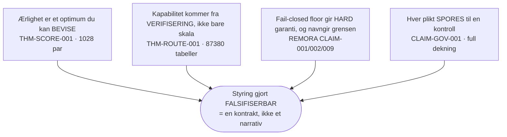

- **Ærlighet er ikke en dyd du oppfordrer til; det er et optimum du kan bevise.**
  En proper scoring-regel gjør sannferdig sannsynlighetsrapportering til det
  unike minimum for forventet tap, verifisert eksakt over 1028
  (sann-fordeling, alternativ-rapport)-par [THM-SCORE-001]. Skår komponentene
  dine på kalibrering, og du belønner ærlighet *mekanisk*.
- **Kapabilitet kommer fra verifisering, ikke bare fra skala.** En
  verifiseringsport-styrt kaskade lar en billig generator pluss en selektiv sjekk
  dominere en monolitt på kost/nøyaktighet (over 87 380 uttømmende
  rutetabeller [THM-ROUTE-001]) med flertallsstemme-amplifikasjonen bevist *og*
  dens ærlige konvers (stemmegivning *degraderer* en dårligere-enn-tilfeldig
  velger) bevist også [THM-VOTE-002].
- **En fail-closed policy-floor gir et hardt, benchmark-avgrenset sikkerhetsgulv,
  og samme evidensbase navngir grensen.** REMORAs port ga **0,0 %** usikker-kjørerate på
  en 700-oppgavers adversariell benchmark mot 10 til 20 % for heuristikker [REMORA
  CLAIM-001], og blokkerte **alle 208** uavhengige AgentHarm-scenarier,
  *eksternt validert* [REMORA CLAIM-002]. AROMER-negativresultatet viser ærlig
  det residuale **30,7 %** falsk-aksept under nøytral metadata [REMORA
  CLAIM-009].
- **Hver regulatorisk plikt spores til en verifisert kontroll.** 29 elementer
  fra fem regimer avbildes til 10 kontrollmål med full toveis-dekning,
  fail-closed [CLAIM-GOV-001].

Kombinasjonen er poenget: usikkerhetsteori sier *når* man skal avstå;
verifikasjonsmatematikken sier at avståelse og ruting *gir kapabilitet*;
runtime-evidensen viser at en floor *virker og hvor den svikter*;
kryssreferansen viser *hvilken regulator hver kontroll svarer til*; og porten får
hele kjeden til å *nekte å beskrive seg selv over evidensen sin*.

---

## 2. Hva AI-styring er, og hvorfor det meste feiler

▶ **Enkelt forklart:** styring er settet av regler, roller og sjekker som
holder et AI-system trygt, rettferdig, lovlig og ansvarlig. Det meste feiler
fordi det er *ikke-falsifiserbart*: et dokument påstår gode egenskaper, og
ingen kan sjekke dem mekanisk.

▷ **I dybden.** AI-styring svarer på fire spørsmål: *Hvem er ansvarlig? Hva
kan gå galt? Hvordan vet vi at det virker? Hva skjer når det ikke gjør det?*
Tradisjonell styring svarer i prosa: en policy-perm, et modellkort, en
etikk-erklæring. Feilmodusen er strukturell: prosa akkumulerer *beroligelse*
uten *evidens*. Et modellkort kan si «overvåket for drift» enten noe overvåker
noe eller ikke. En revisor kan ikke skille et samvittighetsfullt program fra et
kosmetisk ved å lese dokumentet. Begge leser likt.

Innsikten denne håndboken operasjonaliserer er å gjøre hver
styringspåstand til en **påstand** med en committed artefakt, et evidensnivå og
et forbehold, eller å *nekte å skrive den*. Nektelsen er disiplinen. Et
styringsprogram som ikke stille kan akkumulere ustøttet beroligelse er ett en
revisor kan stole på.

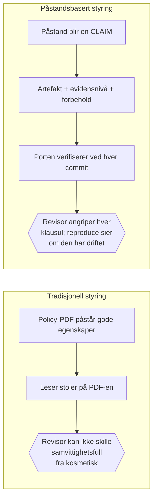

**Hvorfor frontier-AI hever innsatsen.** Frontier-systemer er agentiske (de
handler gjennom verktøy), ugjennomsiktige (resonnementet er ikke direkte
inspiserbart) og hurtigskiftende (kapabilitet endres mellom releaser). Hver
egenskap slår ut en klassisk kontroll: agens slår ut «gjennomgå outputen»
(handlingen har alt skjedd), ugjennomsiktighet slår ut «forklar beslutningen»
(det finnes ingen lesbar regel), fart slår ut «sertifiser én gang» (det
sertifiserte systemet er alt utdatert). Svaret er ikke mer prosa: det er
*runtime*-håndhevelse (del II, familie 4), *selektiv* autonomi (familie 1 til 3) og
*kontinuerlig* verifisering (porten, §5).

---

## 3. Påstandsbasert programmering fra grunnen

▶ **Enkelt forklart:** påstandsbasert programmering (COP) er Design-by-Contract
løftet fra én funksjon til et helt prosjekt. En **påstand** er et løfte om
systemet støttet av en fil på disk, sjekket automatisk. Regelen er enkel: *ingen
tall uten en artefakt.*

▷ **I dybden.** Design by Contract (Meyer) fester for-betingelser,
etter-betingelser og invarianter til funksjoner. COP løfter det til prosjektet:
enhver faktapåstand et prosjekt gjør om *seg selv* (et benchmark-tall, en
kapabilitet, en samsvarsegenskap) er en kontrakt mellom ordene og evidensen,
sjekket i CI av VeriClaim-porten.

**Den ene regelen:**

> Ingen tall uten en artefakt. Ingen dok-tall som ikke er bundet til registeret.
> Ingen påstand beskrevet over evidensen den har.

**STOPP-refleksen.** I det øyeblikket du er i ferd med å skrive et faktatall,
stopp: (1) *Hvilken committed artefakt etablerer dette?* (2) *Er det i
registeret?* (3) *Stemmer registerverdien?* (4) *Bærer prosaen forbeholdet?* Kun
hvis alle fire passerer skriver du setningen. Finnes ingen artefakt har du tre
ærlige trekk: produser den, registrer påstanden på `theoretical` og si det, eller
ikke skriv tallet. Det finnes ikke et fjerde trekk.

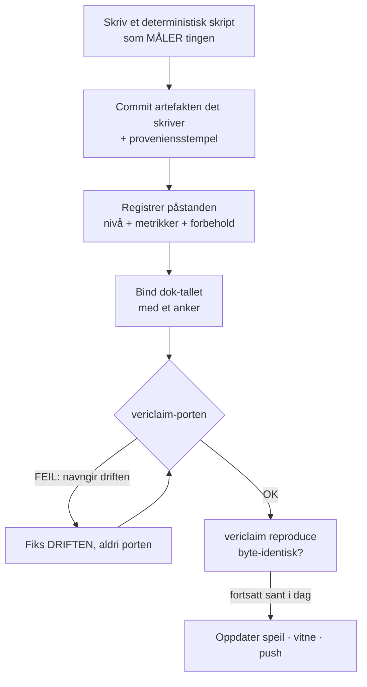

**Formen på hver påstand:**

```yaml
- id: CLAIM-AREA-001
  statement: "Én linje: hva som påstås."
  evidence_level: benchmarked   # se stigen, §4
  artifact: [results/example.json]
  metrics: { value: 42 }        # tallene dokene kan sitere
  caveat: "Omfang og begrensning: del av claimen, ikke en fotnote."
  reproduce: "python3 bench/example.py"
```

**Hvorfor dette er et styringssubstrat, ikke bare en kodevane.** Hver klausul
i et styringsargument («policy håndhevet», «drift overvåket», «plikter
kartlagt») blir en påstand på et oppgitt evidensnivå. Styringsprogrammet *er*
registeret. Tilliten til det er ikke retorisk; den er utfallet av en port som
nekter drift.

---

## 4. Evidensstigen

▶ **Enkelt forklart:** ikke all evidens er lik. Stigen har seks trinn fra «vi
argumenterte for det» til «en uavhengig part bekreftet det». En påstand kan bare
*beskrives* på trinnet den har *fortjent*.

▷ **I dybden.** Stigen, svakest til sterkest:

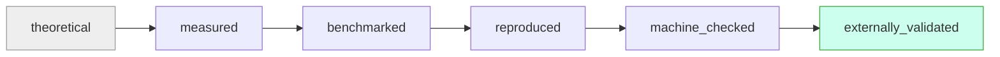

| Trinn | Betydning | Eksempel i biblioteket |
|---|---|---|
| **theoretical** | argumentert fra prinsipper eller en bibliografisk peker; ingen måling | en litteraturreferanse [REF-051] |
| **measured** | en deterministisk måling over en committed artefakt | styringskryssreferansens dekning [CLAIM-GOV-001] |
| **benchmarked** | målt på en definert benchmark med oppgitt protokoll | REMORAs 700-oppgavers resultat [REMORA CLAIM-001] |
| **reproduced** | reprodusert *uavhengig* (annen maskin, person eller konfigurasjon) | ikke hevdet for en egen-påstand; `vericlaim reproduce` re-verifiserer byte-identitet løpende, men det er selv-verifisering, ikke den uavhengige reproduksjonen dette trinnet krever |
| **machine_checked** | verifisert ved uttømmende/eksakt beregning | teorem-batteriene [THM-ROUTE-001] |
| **externally_validated** | bekreftet av en uavhengig part eller uavhengige data | AgentHarm datasett-uavhengighet [REMORA CLAIM-002] |

Gradering er **konservativ**: beskriv en påstand kun på nivået den har fortjent.
Nedgradering er alltid tillatt; oppgradering krever ny evidens. Stigen er
styringsprogrammets ærlighetsskala, og porten håndhever den (et dokument kan
ikke beskrive en påstand over det fortjente nivået).

> **⚠️ Et subtilt poeng.** `machine_checked` er *sterkere* enn `benchmarked` for
> egenskapen den dekker, men dekker en *mindre* egenskap: et eksakt matematisk
> faktum på avgrensede instanser, ikke et virkelig-verden-utfall.
> `externally_validated` er det sterkeste *verdslige* trinnet. Ingen av dem
> dominerer den andre på tvers av alle spørsmål; les hva hver påstand faktisk
> dekker.

---

## 5. VeriClaim-porten: hva den sjekker

▶ **Enkelt forklart:** porten er en automatisk sjekker som kjører ved hver commit
og nekter å la prosjektets ord løpe forbi evidensen.

▷ **I dybden.** Standardporten er bivirkningsfri og sjekker ni ting:

```mermaid
flowchart TB
    subgraph Gate["vericlaim (hver commit), fail-closed"]
        G1[1 Register-integritet<br/>fail-closed parsing] --> G2[2 Artefakt-eksistens]
        G2 --> G3[3 Sti-inneslutning<br/>ingen .. ingen absolutt ingen symlink]
        G3 --> G4[4 Proveniens-følgefiler<br/>hvordan hver artefakt ble laget]
        G4 --> G5[5 Manifest-hasher<br/>SHA-256 stemmer]
        G5 --> G6[6 Dok-binding<br/>prosa + kodekommentarer til registeret]
        G6 --> G7[7 Evidensnivå-ærlighet]
        G7 --> G8[8 Undertrykking av utdaterte strenger]
        G8 --> G9[9 Litteratur-integritet<br/>kilden hasher fortsatt til registrert SHA]
    end
    Gate --> OK{{[OK] eller navngir eksakt<br/>fil:linje som driftet}}
```

En separat kommando, `vericlaim reproduce`, *kjører* hvert evidensskript og
feiler med mindre artefakten er byte-identisk: tallet er *fortsatt sant i dag*.

**Hva porten beviser, og ikke.** Den beviser *intern konsistens og
reproduserbarhet*. Den beviser **ikke** at en benchmark er
produksjonsrealistisk, at evidens ikke ble manipulert før commit, at
`externally_validated` faktisk var eksternt, eller at en *setning* er korrekt:
dok-binding beviser at et tall er **til stede og register-matchet**, ikke at
den omkringliggende prosaen er sann. Å holde seg innenfor den grensen er selv en
del av disiplinen (§24).

---

## 6. Cloudflare-sannhetslaget: RAG, hvelv, hovedbok, orakel

▶ **Enkelt forklart:** en valgfri edge-tjeneste som gjør registeret om til en
søkbar, tamper-evident, hash-kjedet post: pluss en litteratur-RAG som *nekter*
å svare når den ikke har grunnlag.

▷ **I dybden.** Sannhetslaget speiler det autoritative registeret inn i en
Cloudflare-stack og legger til en litteratur-RAG. Det er strengt *additivt*:
registeret + porten forblir sannhetens kilde; edge kan være utdatert og blokkerer
aldri.

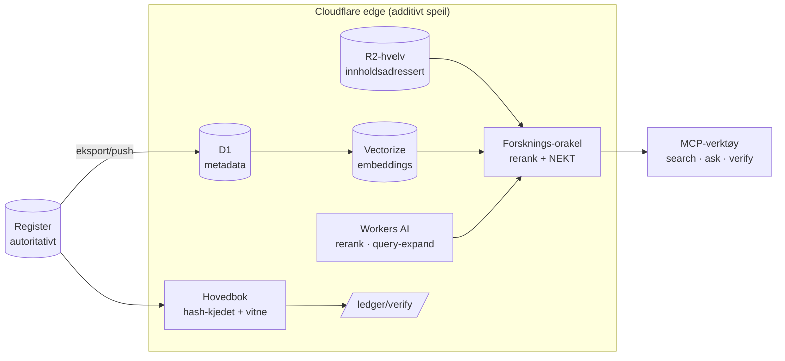

**Tre ærlighetsegenskaper:**
1. **Gjenfinning, aldri evidens.** Søkbarhet beviser at et verk var
   registrar-verifisert eller ærlig snapshottet og hash-låst, *ikke* at
   innholdet er sant. Tier følger hvert treff.
2. **Nektelse ved grensen.** Orakelet nekter når ingen chunk klarer
   relevansbaren; nektelsen skåres kun mot *klarerte* fraseringer av spørringen,
   så en prompt-injisert spørring kan ikke manufakturere relevans: den
   forankrede generatoren er den autoritative vakten mot overpåstand.
3. **Tamper-evidens.** Hovedboken er append-only og hash-kjedet; klient-
   verifikatoren bekrefter at den ikke er omskrevet siden første anker.
   Bibliotek-hovedboken står nå på 1408 oppføringer over 192 verifiserte
   bundles.

---
---

# Del II: Kunnskapsbasen

## 7. Kanon: 180 verk over 15 kolleksjoner

▶ **Enkelt forklart:** et kuratert, hash-låst bibliotek på 180 forskningsverk og
standarder, vektorisert så du kan stille det spørsmål, og det svarer bare når
det har grunnlag.

▷ **I dybden.** Alle skala-tall er fra CLAIM-LIB-RAG-familien:

| Egenskap | Verdi | Sitering |
|---|---|---|
| Kanon-verk | 180 over 15 kolleksjoner | [CLAIM-LIB-RAG-001] |
| Registrar-verifisert inn i katalogen | 171 | [CLAIM-LIB-RAG-001] |
| Dokumenterte drops (ærlige hull) | 9, med 0 udokumenterte | [CLAIM-LIB-RAG-001] |
| Innholdsadresserte chunks, alle live | 9805 | [CLAIM-LIB-RAG-002] |
| Live forsknings-endepunkter verifisert | ende-til-ende | [CLAIM-LIB-RAG-003] |
| Bibliotek-hovedbok oppføringer / bundles | 1408 / 192 | hovedbok `/summary` |

**Slik virker gjenfinning + nektelse** (hvorfor du kan stole på et svar):

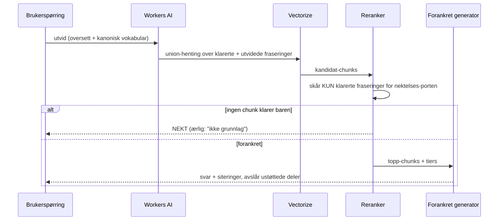

Full kolleksjonsindeks er Appendiks A. De fire verifiserte *byggestein*-familiene
(§§8-11) er den gjenbrukbare, maskinsjekkede kjernen; litteraturen (§§12-13) er
konteksten de hviler på.

---

## 8. Byggestein-familie 1: usikkerhet og selektiv prediksjon

▶ **Enkelt forklart:** matematikken som lar et system *vite når det ikke vet* og
avstå i stedet for å gjette, med en dekningsgaranti som holder uten å anta
datafordelingen.

▷ **I dybden.** Konform prediksjon pakker enhver prediktor til å gi et *sett*
(eller intervall) som inneholder sannheten med en valgt sannsynlighet,
fordelingsfritt og endelig-utvalg. Den eksakte kombinatorikken i
dekningsgarantien er maskinsjekket [THM-CONF-001], og en kjørt
runtime-demonstrasjon viser konforme intervaller som dekker sannheten i **373 av
400** runder (0,9325 mot et mål på 0,9) [DEMO-001].

**Hvorfor styring trenger dette.** «Systemet vet når det ikke vet» er
forutsetningen for *selektiv autonomi*: handle når sikker, avstå og eskaler når
ikke. Det innløser EU AI Act artikkel 15-kravet til nøyaktighet/robusthet og
NIST AI RMF MEASURE-funksjonen.

> **Nykommerens intuisjon.** Tenk deg en værapp som, i stedet for alltid å si
> «70 % regn», av og til sier «denne klarer jeg ikke å kalle. Spør et
> menneske». En konform innpakning er den prinsippfaste versjonen: den er
> *garantert* å ha rett om hvor ofte den har rett, så avståelsene er til å stole
> på.

**Ærlig grense.** Garantien er *marginal* (over fordelingen), ikke per-instans;
den antar utvekslbare data; og demonstrasjonen [DEMO-001] er én seedet,
deterministisk kjøring med en fast prediktor, forenlig med garantien, ikke mer.

---

## 9. Byggestein-familie 2: verifiser-amplifikasjon

▶ **Enkelt forklart:** å sjekke et svar er ofte billigere og mer pålitelig enn å
produsere det, så en billig produsent pluss en god sjekker kan slå en dyr
produsent. Dette er *hvorfor* «rut vanskelige tilfeller til sterkere
gjennomgang» virker.

▷ **I dybden.** Tre maskinsjekkede resultater:

- **Best-of-n er en eksakt identitet.** Med n uavhengige forsøk hver med
  suksess-sannsynlighet p er sjansen for at minst ett lykkes 1 − (1−p)ⁿ,
  verifisert eksakt ved enumerasjon [THM-VOTE-001].
- **Flertallsstemme amplifiserer, og degraderer ærlig.** Med uavhengige
  velgere bedre enn tilfeldig stiger flertallets nøyaktighet mot 1 (Condorcet);
  med velgere *dårligere* enn tilfeldig faller den mot 0. Begge retninger er
  bevist [THM-VOTE-002]. Konversen er den ærlige halvdelen de fleste
  fremstillinger utelater.
- **Verifiseringsport-styrte kaskader dominerer monolitter.** Å rute hvert element til en
  stor modell kun når en billig verifikator er usikker, slår alltid-stor og
  alltid-liten på kost/nøyaktighet-fronten, etablert over 87 380 uttømmende
  rutetabeller [THM-ROUTE-001].

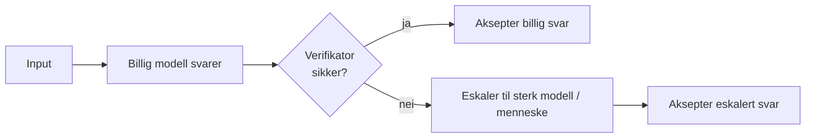

**Hvorfor styring trenger dette.** Det er den formelle lisensen for
menneske-tilsyn (art. 14) og MANAGE (AI RMF)-kontrollene: avstå-og-eskaler er
ikke et kostnadssenter, det er på den effektive fronten. Det underbygger også
tesen «kapabilitet fra verifisering, ikke skala» i §1.

---

## 10. Byggestein-familie 3: beslutningsteori under usikkerhet

▶ **Enkelt forklart:** de små, eksakte resultatene bak gode beslutninger,
inkludert beviset for at *å fortelle sannheten om din egen sikkerhet er den
optimale strategien*.

▷ **I dybden.** Fire eksakte (rasjonal-aritmetiske) resultater:

- **Brier-properness: ærlighet er optimalt.** Å rapportere dine *sanne*
  sannsynligheter minimerer entydig forventet Brier-skår; enhver annen rapport
  skårer strengt dårligere, verifisert over 1028 (sann-fordeling,
  alternativ-rapport)-par [THM-SCORE-001]. Dette er den formelle grunnen til at
  et kalibrerings-skåret program belønner ærlighet.
- **Sekretær optimal stopping.** Den optimale utforsk-så-forplikt-terskelen og
  dens eksakte vinnersannsynlighet stemmer ved DP for hver n ≤ 20
  [THM-STOP-001].
- **Minimax = maximin.** Hvert 2×2 heltalls-utbetalings nullsumspill har én
  verdi begge spillere kan sikre, over alle 6561 spill [THM-GAME-001]. Dette
  underbygger verste-fall-(adversariell) planlegging.
- **Jensen / varians ≥ 0.** Ulikheten bak hver forventningsgrense, eksakt over
  rutenettet [THM-JENSEN-001].

> **Hvorfor THM-SCORE-001 er det stille tyngdepunktet.** Styring ber stadig
> mennesker og modeller om å «være ærlige om usikkerhet». Proper scoring gjør
> det fra en oppfordring til en *likevekt*: under en proper skår er det
> entydig-beste trekket å si det du faktisk tror. Bygg evalueringen din på en
> proper skår, og du har gjort ærlighet til den dominante strategien.

---

## 11. Byggestein-familie 4: runtime-håndhevelse (REMORA/AROMER)

▶ **Enkelt forklart:** en policy-som-kode-port som blokkerer usikre
agent-handlinger *før* de kjører, bevist å virke, og ærlig om nøyaktig hvor den
slutter å virke.

▷ **I dybden.** REMORA-research-prosjektet leverer runtime-styringsevidensen,
port-verifisert i sitt eget repo og innhentet i biblioteket.

**Floor-en virker.** REMORAs fulle policy-port ga **0,0 %** usikker-kjørerate på
en 700-oppgavers adversariell verktøykall-benchmark, mot 10 til 20 % for hver
heuristisk baseline; Wilson 95 % KI på falsk-aksept [0,00 %, 0,55 %] [REMORA
CLAIM-001]. Avgjørende: floor-en kommer fra **Stage-1 hard-block
policy-invarianter**, ikke fra konsensus-maskineriet; påstanden forbyr å sitere
den som evidens for konsensuslaget.

**Eksternt validert.** På AgentHarm (arxiv:2410.09024) blokkerte REMORA **alle
208** uavhengige skadelige scenarier, FAR 0,0 %, Wilson [0,00 %, 1,81 %],
gradert `externally_validated` ved datasett-uavhengighet [REMORA CLAIM-002].

**Grensen er publisert, ikke skjult.** Under *nøytralt utseende* trust-metadata
(trust=0,70) er den strukturelle policyens falsk-aksept-rate **43,0 %**
(kun strukturell), fallende til **30,7 %** etter semantisk berikelse, et
residualt gap som krever runtime-kjøringsovervåking [REMORA CLAIM-009]. Merket et
NEGATIVT RESULTAT som «må IKKE fjernes eller undertrykkes».

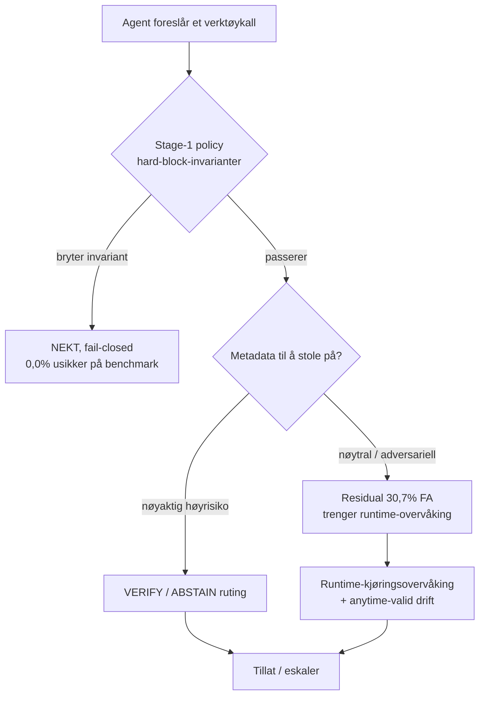

**Den sammensatte lærdommen (en styrt påstand, ikke en mening):** forsvar i
dybden. En fail-closed floor er *nødvendig* for en hard garanti, men
*utilstrekkelig* mot motstandere som leverer godartet-utseende metadata, så den
må parres med runtime-overvåking og drift-deteksjon: nøyaktig art. 15 + art. 14
+ post-market-komposisjonen det regulatoriske laget krever, kommet frem til
empirisk.

---

## 12. Frontier- og AGI-litteratur som styringsgrunnlag

▶ **Enkelt forklart:** du kan ikke styre det du ikke forstår, så biblioteket
sporer fronten (resonneringsmodeller, agenter, verdensmodeller, tolkbarhet) og
inkluderer bevisst også de *skeptiske* artiklene.

▷ **I dybden.** Kolleksjon 15 (28 verk) er balansert med ærlige motstykker:

| Tema | Representative verk | Styringsrelevans |
|---|---|---|
| Resonnering / test-time compute | zero-shot reasoning; DeepSeek-R1 (arxiv:2501.12948); RAP; graph-of-thoughts | risiko flyttes fra trening til inferens: overvåking må følge |
| Agenter | Voyager; generative agents; SWE-agent; AutoGen | autonom verktøybruk er flaten REMORA styrer: trusselmodellen |
| Verdensmodeller | MuZero; DreamerV3; decision transformer | planleggende agenter internaliserer mål: tilsyn må nå inn i loopen |
| Arkitekturer | Mamba/S4; RWKV; ViT; CLIP; Flamingo | lang kontekst + multimodal utvider kapabilitet *og* angrepsflate |
| Tolkbarhet | induction heads; representation engineering; influence functions; Platonic-hypotesen | gjør transparens (art. 13) + tilsyn (art. 14) håndterbart |
| AGI-framing + grenser | Sparks (arxiv:2303.12712); Levels (arxiv:2311.02462); scalable oversight (arxiv:2211.03540); *«Emergent Abilities a Mirage?»* | den skeptiske artikkelen står ved siden av AGI-påstands-artikkelen: samme disiplin som å publisere AROMER-negativresultatet |

Agendaen om verifiserbare påstander som hele systemet operasjonaliserer er selv i
kanon: «Toward Trustworthy AI Development: Mechanisms for Supporting Verifiable
Claims» (arxiv:2004.07213) [REF-051], ved siden av «Open Problems in Technical
AI Governance» (arxiv:2407.14981) [REF-057].

---
---

# Del III. Regler: regulering og standarder

## 13. Det regulatoriske landskapet forklart

▶ **Enkelt forklart:** en håndfull rammeverk styrer AI. De overlapper mer enn de
skiller seg; knepet er å se dem som ulike *rapporteringsvinkler* på de samme
underliggende kontrollmålene.

▷ **I dybden.** Regimene denne håndboken kartlegger (kanon-kolleksjon 05-06):

- **NIST AI RMF 1.0**: et *frivillig, risikobasert* amerikansk rammeverk. Fire
  funksjoner: **GOVERN** (kultur/ansvar), **MAP** (kontekst/risikoforståelse),
  **MEASURE** (analyser/spor), **MANAGE** (prioriter/respons). Ikke en
  sjekkliste, en livssyklus.
- **EU AI Act**: *bindende EU-lov*, risiko-lagdelt. For **høyrisiko**-systemer
  krever artikkel 9 til 15 et risikostyringssystem, datastyring, teknisk
  dokumentasjon, journalføring, transparens, menneskelig tilsyn og
  nøyaktighet/robusthet/cybersikkerhet. Det mest preskriptive regimet her.
- **ISO/IEC 42001**: en *sertifiserbar AI-styringssystem-standard* (som ISO
  27001 for infosikkerhet). Plan-Do-Check-Act over klausul 4 til 10 (kontekst,
  ledelse, planlegging, støtte, drift, ytelsesevaluering, forbedring).
- **NIST CSF 2.0**: *cybersikkerhets*-rammeverket, nå med en GOVERN-funksjon:
  GOVERN, IDENTIFY, PROTECT, DETECT, RESPOND, RECOVER. AI-systemer er
  programvaresystemer; CSF gjelder fortsatt.
- **NIST Privacy Framework**: personvern-risiko-følgesvenn til CSF: IDENTIFY-P,
  GOVERN-P, CONTROL-P, COMMUNICATE-P, PROTECT-P.
- **GDPR / NIS2** (kanon-kolleksjon 05): EU personvern- og
  nettverks/informasjonssikkerhets-lov; det juridiske gulvet under datastyring
  og sikkerhet.

> **Det forenende trekket.** I stedet for å kjøre fem samsvarsprogrammer,
> avbild alle fem på ett sett **kontrollmål** og tilfredsstill dem. §14 gjør
> nettopp det, med et fail-closed dekningsbevis.

---

## 14. Styringskryssreferansen (CLAIM-GOV-001)

▶ **Enkelt forklart:** ett kart som kobler hvert rammeverks deler til ti delte
kontrollmål, med en sjekker som *nekter å kompilere* hvis noen del er ukartlagt
eller noe mål udekket.

▷ **I dybden.** [CLAIM-GOV-001] koder den offentlige toppstrukturen til fem
regimer (29 elementer) og avbilder dem til 10 delte kontrollmål via 42 kanter,
verifisert for **full toveis-dekning** (ingen foreldreløse elementer, ingen
udekte mål, hvert mål krevet av ≥2 rammeverk), fail-closed.

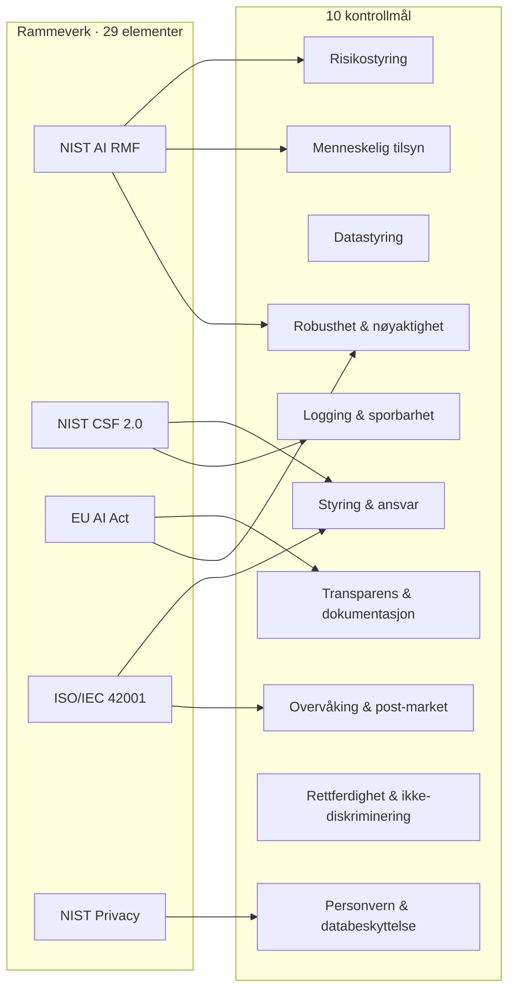

*(Diagrammet viser representative kanter; hele 42-kanters-matrisen er Appendiks
C.)*

**Hva det er / ikke er.** En gjenbrukbar sporbarhets-byggestein et prosjekt
vendorer for å se hvilke mål hvert regime krever og sjekke sitt eget
kontrollsett: **ikke** juridisk rådgivning, **ikke** sertifisering, **ikke**
bevis på at noen kontroll er korrekt implementert. Artikkel/klausul-spesifikker
under toppnivået er utenfor omfang. Den grensen er en del av påstanden.

---

## 15. De ti kontrollmålene: oppslag

For hvert mål: en enkel definisjon, hvilke rammeverk krever det (fra den
fail-closede kryssreferansen [CLAIM-GOV-001]), hvilken VeriClaim-byggestein
operasjonaliserer det, og det ærlige evidensnivået.

1. **Styring & ansvar**: AI RMF GOVERN, CSF GOVERN, ISO
   kontekst/ledelse/støtte, Privacy GOVERN-P. *Operasjonalisert av:* registeret
   + hovedboken som den ansvarlige posten. *Nivå:* measured.
2. **Risikostyring**: AI RMF GOVERN/MAP/MANAGE, CSF IDENTIFY, EU
   risikostyringssystem, ISO planlegging. *Operasjonalisert av:* verifiseringsport-styrt
   ruting [THM-ROUTE-001] + konform avståelse [THM-CONF-001]. *Nivå:*
   machine_checked (matematikken) / benchmarked (anvendelsen).
3. **Datastyring**: AI RMF MAP, CSF IDENTIFY, EU datastyring, Privacy
   IDENTIFY-P. *Operasjonalisert av:* proveniens/supply-chain-kolleksjon (07) +
   innholdsadressert hvelv. *Nivå:* measured.
4. **Transparens & dokumentasjon**: AI RMF MAP, EU teknisk-dok/transparens,
   Privacy COMMUNICATE-P. *Operasjonalisert av:* påstandsforbehold + evidensnivå +
   dok-bindings-porten. *Nivå:* measured.
5. **Menneskelig tilsyn**: AI RMF MANAGE, EU menneskelig-tilsyn, ISO drift.
   *Operasjonalisert av:* verifiseringsport-styrt eskalering [THM-ROUTE-001]; REMORA
   VERIFY/ABSTAIN-ruting. *Nivå:* machine_checked / benchmarked.
6. **Robusthet & nøyaktighet**: AI RMF MEASURE, CSF PROTECT, EU
   nøyaktighet/robusthet, ISO drift. *Operasjonalisert av:* den fail-closede
   policy-flooren [REMORA CLAIM-001/002]. *Nivå:* benchmarked /
   externally_validated.
7. **Logging & sporbarhet**: CSF DETECT, EU journalføring. *Operasjonalisert
   av:* den hash-kjedede vitne-hovedboken + proveniens-følgefiler. *Nivå:*
   measured.
8. **Overvåking & post-market**: AI RMF MEASURE/MANAGE, CSF
   DETECT/RESPOND/RECOVER, ISO ytelsesevaluering/forbedring. *Operasjonalisert
   av:* `vericlaim reproduce`; anytime-valid overvåking (REMORA REM-020).
   *Nivå:* measured.
9. **Rettferdighet & ikke-diskriminering**: AI RMF MEASURE, EU datastyring.
   *Operasjonalisert av:* rettferdighet/personvern-kolleksjonen (09). *Nivå:*
   theoretical→measured, **det tynneste trinnet** (se §25).
10. **Personvern & databeskyttelse**: CSF PROTECT, Privacy
    IDENTIFY-P/CONTROL-P/PROTECT-P. *Operasjonalisert av:* personvern-
    kolleksjonen (09) + GDPR/NIS2-litteratur (05). *Nivå:* measured.

---
---

# Del IV: Enterprise-arkitektur

## 16. Enterprise-arkitektur på 5 minutter (TOGAF, Zachman, ArchiMate)

▶ **Enkelt forklart:** enterprise-arkitektur (EA) er disiplinen med å designe en
organisasjons systemer som en sammenhengende helhet. TOGAF er den vanligste
*metoden*; Zachman er et *klassifiseringsrutenett*; ArchiMate er et
*modelleringsspråk*. Styring lykkes når den kobles inn i det virksomheten
allerede bruker.

▷ **I dybden.**
- **TOGAF ADM**: Architecture Development Method, en syklus av faser
  (Preliminary, A-H) med Requirements Management i sentrum. Svarer på *hvordan*
  utvikle og styre arkitektur over tid.
- **Zachman-rammeverket**: et 6×6-rutenett (Hva/Hvordan/Hvor/Hvem/Når/Hvorfor ×
  perspektiver). Svarer på *hvilke artefakter* en komplett arkitekturbeskrivelse
  inneholder, nyttig som fullstendighets-sjekkliste.
- **ArchiMate**: en notasjon med forretnings/applikasjons/teknologi-lag. Svarer
  på *hvordan tegne* arkitekturen entydig.

Denne håndboken avbilder VeriClaim-byggesteinene på **TOGAF ADM** (§17) fordi
ADMs fasestruktur passer naturlig til en styringslivssyklus, og dens
Requirements-Management-ryggrad avbildes på registeret.

---

## 17. Byggesteinene plassert i TOGAF ADM

▶ **Enkelt forklart:** hver fase i den standard arkitekturmetoden får en
*falsifiserbar* leveranse i stedet for en prosa-leveranse.

▷ **I dybden.**

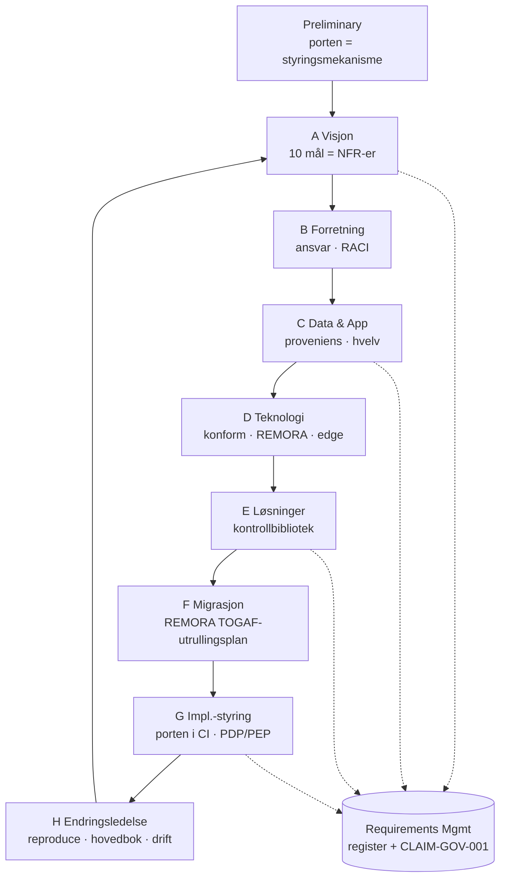

| ADM-fase | Styringshensyn | VeriClaim-byggestein | Rammeverksanker |
|---|---|---|---|
| **Preliminary** | Etabler kapabiliteten | Porten som arkitektur-styringsmekanisme; registeret som krav-repositorium | ISO 42001 ledelse; AI RMF GOVERN |
| **A: Visjon** | Risikoappetitt, mål | De 10 kontrollmålene [CLAIM-GOV-001] som ikke-funksjonelle krav | EU AI Act art. 9; AI RMF MAP |
| **B: Forretning** | Roller, ansvar | `governance_accountability`; RACI over registeret | ISO 42001 ledelse; CSF GOVERN |
| **C: Data & Applikasjon** | Datakvalitet, proveniens, dok | Proveniens-kolleksjon (07); innholdsadressert hvelv | EU AI Act art. 10-11 |
| **D: Teknologi** | Robusthet, runtime | Konform [THM-CONF/DEMO-001]; REMORA [CLAIM-001/002]; edge | EU AI Act art. 15; CSF PROTECT |
| **E: Løsninger** | Hvilke kontroller å bygge | Det verifiserte kontrollbiblioteket (§§8-11) | AI RMF MEASURE/MANAGE |
| **F: Migrasjon** | Utrullingssekvens | REMORA enterprise TOGAF-utrullingsplan | ISO 42001 planlegging |
| **G: Impl.-styring** | Håndhevelse i leveranse | Porten i CI; fail-closed PDP/PEP [REMORA CLAIM-001] | EU AI Act art. 14; CSF DETECT |
| **H: Endringsledelse** | Drift, overvåking | `reproduce`; vitne-hovedbok; anytime-valid overvåking | EU AI Act art. 15; CSF RESPOND/RECOVER |
| **Requirements Mgmt** | Sannhetens kilde | Register + kryssreferanse | alle fem regimer |

---

## 18. En referansearkitektur for et styrt AI-system

▶ **Enkelt forklart:** tegningen: data kommer inn, en modell handler, en
fail-closed port står mellom modellen og verden, og alt logges til en
tamper-evident hovedbok og re-verifiseres kontinuerlig.

▷ **I dybden.**

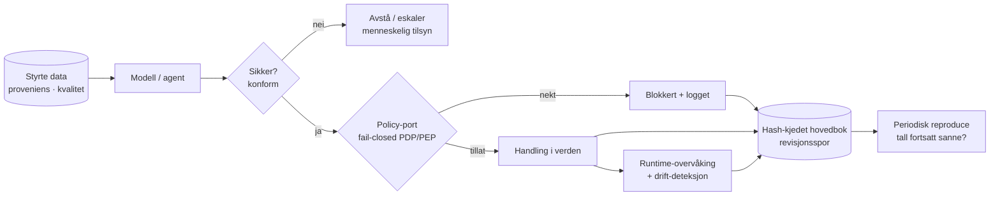

Hvert element avbildes på et kontrollmål (§15) og en byggestein (§§8-11).
Arkitekturens definerende egenskap er at **porten er i handlings-stien**, ikke
ved siden av: en ukjent handling nekter som standard (fail-closed), og
nektelsen er selv en revisjonshendelse.

---

## 19. Operasjonsmodell, roller og kadens

▶ **Enkelt forklart:** hvem gjør hva, hvor ofte, så styring forblir sann over
tid i stedet for å råtne til utdatert dokumentasjon.

▷ **I dybden.**

| Kadens | Aktivitet | Eier |
|---|---|---|
| **Kontinuerlig (CI)** | Porten ved hver commit; fail-closed | hver bidragsyter |
| **Per release** | `reproduce` over hele registeret; speil-oppdatering; vitne | release-ingeniør |
| **Periodisk (styringsgjennomgang)** | Re-kjør kryssreferanse-dekning; gjennomgå evidensnivå for drift/nedgradering; sjekk ærlig-hull-listen (§25) | den ansvarlige styringsrollen (ISO 42001 ledelse) |
| **Ved hendelse** | Hovedbokens append-only-historikk er revisjonssporet; `reproduce` re-etablerer hvilke tall som fortsatt holder | hendelseseier |

**RACI, minimalt:** *registeret* er Accountable til styringsrollen,
Responsible til hver bidragsyter, Consulted med arkitekturpraksisen (TOGAF), og
Informed til revisorer/regulatorer via hovedboken.

---
---

# Del V: Praksis

## 20. Slik bygger du en styrt AI-funksjon

▶ **Enkelt forklart:** mål først, påstand andre, skriv prosaen sist, og la porten
ta deg hvis du drifter.

▷ **I dybden**, som en sjekkliste:

1. **Produser evidensen.** Skriv et *deterministisk* skript som måler
   egenskapen; commit artefakten det skriver med et proveniensstempel.
2. **Registrer påstanden** på dens *fortjente* nivå, med metrikker og et forbehold.
3. **Bind hvert dok-tall** med et `<!-- claim:ID felt -->`-anker.
4. **Kjør `vericlaim`**: må skrive `[OK]`; den navngir enhver drift med
   `fil:linje`.
5. **Kjør `vericlaim reproduce`** når kode en benchmark avhenger av endret.
6. **Oppdater edge-speilet**; for bibliotek-endringer, **vitne** og push
   `claims/witness.jsonl`.

> **Refleksen som betyr mest:** når du er i ferd med å skrive et tall og ingen
> artefakt finnes, stopp. Produser den, eller registrer på `theoretical` og si
> det, eller ikke skriv det.

---

## 21. Slik gjenbruker du en byggestein

▶ **Enkelt forklart:** du kan gjenbruke en verifisert kontroll fra biblioteket
uten å re-utlede den, og du arver dens ærlighet (nivå + forbehold) uendret.

▷ **I dybden.** `fetch_bundle` → `import_bundle` (offline hash-verifisering) →
`use_code` (byte-eksakt vendoring med en bindende test). Et konsumerende
prosjekt arver påstandens evidensnivå og forbehold; en importør kan **nedgradere,
men aldri stille oppgradere**. Eksempelmål: den konforme innpakningen
[THM-CONF], den verifiseringsport-styrte ruteren [THM-ROUTE-001], styringskryssreferansen
[CLAIM-GOV-001], beslutningsteori-batteriet [THM-SCORE/STOP/GAME/JENSEN].

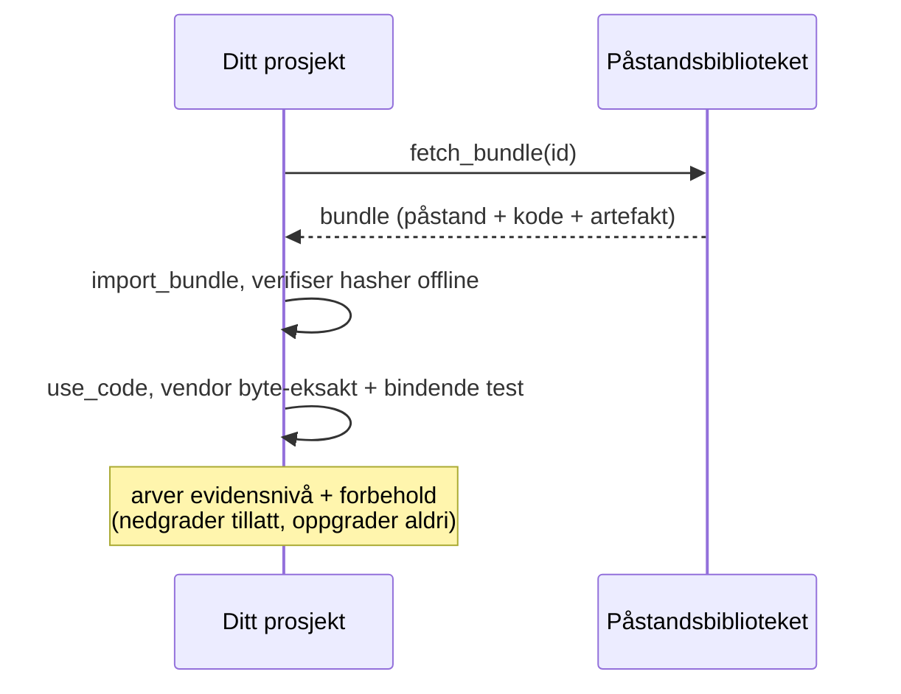

---

## 22. Mønstre og anti-mønstre

| ✅ Mønster | ❌ Anti-mønster |
|---|---|
| Mål, så påstand, så skriv | «Dette tallet er omtrent riktig» |
| Registrer forbeholdet med tallet | Siter tallet, dropp omfanget |
| Avstå-og-eskaler under usikkerhet | Tving alltid et selvsikkert svar |
| Fail-closed standard (nekt det ukjente) | Fail-open («tillat med mindre blokkert») |
| Publiser negativresultatet [REMORA CLAIM-009] | Slett resultater som ser dårlige ut |
| Grader konservativt; nedgrader når evidens svekkes | Stille oppgradering til et penere nivå |
| Ett sett kontrollmål, mange rapporteringsvinkler | Fem parallelle samsvarspermer |
| Fiks driften porten navngir | «Omgå porten» |

---

## 23. Assurance-argumentet

▶ **Enkelt forklart:** hele håndboken, komprimert til én påstand du kan angripe.

▷ **I dybden.**

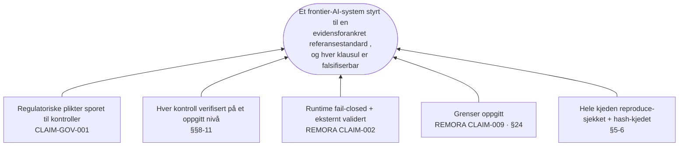

> *Et frontier-AI-system når denne evidensforankrede referansestandarden når hver
> regulatorisk plikt er sporet til en kontroll [CLAIM-GOV-001], hver kontroll er
> verifisert på et oppgitt evidensnivå (§§8-11), runtime er fail-closed med en
> eksternt-validert sikkerhets-floor [REMORA CLAIM-002] hvis grenser er oppgitt
> [REMORA CLAIM-009], og hele kjeden holdes i et append-only, reproduce-sjekket,
> hash-kjedet register som nekter å beskrive seg selv over evidensen sin
> (§§5-6).*

Assurance-saken er ikke «stol på dette dokumentet»; den er «angrip hvilken som
helst klausul: porten, hovedboken og reproduce-ritualet forteller deg om den har
driftet».

---
---

# Del VI: Ærlighet

## 24. Hva dette IKKE beviser

▶ **Enkelt forklart:** grunnen til å stole på de sterke påstandene er at de
svake punktene oppgis like tydelig.

▷ **I dybden.**
- **Porten beviser konsistens og reproduserbarhet, ikke sannhet.** Dok-binding
  beviser at et tall er *til stede og register-matchet*, ikke at setningen er
  korrekt, benchmarken realistisk, eller evidensen umanipulert før commit.
- **Kryssreferansen er strukturell, ikke juridisk** [CLAIM-GOV-001]: ikke
  samsvars-sertifisering; ikke legg den frem for en regulator som
  konformitetsevidens.
- **Runtime-resultater er simulator-scoped**: REMORA kjører ingen ekte
  shell/nettverk/DB/fil-mutasjoner [REMORA CLAIM-001]; AgentHarm-ekstern-
  validiteten er intensjons-gating, ikke verifisert verktøykall-avskjæring
  [REMORA CLAIM-002].
- **Maskinsjekkede teoremer er avgrensede instanser**: eksakte innenfor
  oppgitte grenser (87 380 tabeller [THM-ROUTE-001]; 6561 spill [THM-GAME-001]);
  de generelle asymptotiske utsagnene forblir litteratur.
- **Litteratursiteringer er bibliografiske**: en [REF-NNN] fastslår at
  registrar-posten finnes og ekstraktet er hash-låst, ingenting om verkets
  korrekthet.

## 25. Åpne problemer og ærlige hull

- **Rettferdighet er den tynneste byggesteinen** (§15.9): litteratur-forankret,
  men ingen maskinsjekket rettferdighets-primitiv sammenlignbar med de konforme
  eller verifiser-matematiske batteriene. Navngitt, ikke bortforklart.
- **Feltvalidering av runtime-flooren** står igjen: de 0,0 % er benchmark-scoped
  [REMORA CLAIM-001]; ekte verktøykall-avskjæring er fremtidig arbeid.
- **Kryssreferansen stopper ved toppnivå-struktur**: artikkel/klausul-nivå
  sporbarhet er en naturlig neste byggestein.
- **Assurance-steg med en menneskelig port** (uavhengig gjennomgang av runtime-
  prosjektet) er det høyeste-innflytelse neste steget for de sterkeste
  evidenstrinnene.

Disse definerer perimeteret; et styringsprogram som kjenner sitt eget
perimeter er det som er verdt å stole på innenfor det.

---
---

# Del VII: Identitet, policy og fler-sky-kobling

> Styring er bare ekte hvis den *håndheves*, og håndheves likt uansett hvor
> systemet kjører. Denne delen kobler de abstrakte kontrollmålene (§15) til de
> konkrete skjøtene som bærer identitet og policy på tvers av skyer. Tallene er
> verifisert av **CLAIM-COUPLE-001** (`governance/identity_coupling.py` i
> påstandsbiblioteket), og standardene er bevart hash-låst som litteratur under
> den påstanden.

## 26. Identitet, autentisering og arbeidslast-føderasjon

▶ **Enkelt forklart:** før et system kan håndheve *hva* som er tillatt, må det
vite *hvem* som spør: enten «hvem» er et menneske som logger inn eller én
arbeidslast som kaller en annen. Trikset som gjør dette portabelt er å aldri
sende langlevde hemmeligheter: en arbeidslast beviser hvem den er med et
kortlevd, signert token som alle skyer allerede forstår.

▷ **I dybden.** Identitet deler seg i to problemer med samme løsning.

**Menneskelig autentisering** hviler på **OAuth 2.0** (RFC 6749, delegert
autorisasjon) med **OpenID Connect** (OIDC Core 1.0) lagt oppå for å svare på
*hvem som autentiserte seg*. En OIDC-identitetstilbyder utsteder et signert
**ID-token** (en JWT, RFC 7519) hvis utsteder, publikum og utløp en relying
party verifiserer mot et publisert nøkkelsett. Livssyklus
(inn/endring/ut) bæres av **SCIM 2.0** (RFC 7643/7644), slik at deaktivering
propagerer som en kontroll, ikke en manuell oppgave. **SAML 2.0** er fortsatt
det etablerte assertion-formatet, og alle store IdP-er bygger bro mellom de to.

**Arbeidslast-identitetsføderasjon** fjerner den siste statiske hemmeligheten.
En arbeidslast (en Kubernetes/OpenShift-pod, en CI-jobb) presenterer et
OIDC-token fra en betrodd utsteder; skyen bytter det, via **OAuth 2.0 Token
Exchange** (RFC 8693), mot et kortlevd, snevert scoped sky-credential. Dette er
nøyaktig hva GCP Workload Identity Federation, AWS
`AssumeRoleWithWebIdentity`/IAM Roles Anywhere og Azure federated credentials
hver implementerer. Der sertifikater er identiteten gir **mTLS med X.509**
(RFC 8705, sertifikat-bundne tokens) og **SPIFFE/SPIRE** (portable `spiffe://`
SVID-er) samme garanti for tjeneste-til-tjeneste-kall.

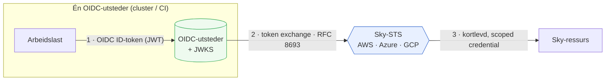

*Én utsteder, tre skyer, samme standard: ingen distribuerte statiske nøkler.
Sikkerheten hviler på publikums-begrensning, påstandsbetingelser og korte TTL-er;
en feil-scoped tillitspolicy fødererer mer enn tiltenkt (se forbeholdet i
CLAIM-COUPLE-001).*

## 27. Policy-as-code og skillet mellom beslutning og håndheving

▶ **Enkelt forklart:** skriv regelen én gang, som kode, og håndhev den likt
overalt. Skill delen som *bestemmer* («er dette tillatt?») fra delen som
*håndhever* den, slik at regelen kan testes, versjoneres og revideres som all
annen kode.

▷ **I dybden.** **NIST SP 800-207 (Zero Trust Architecture)** navngir formen: et
**Policy Decision Point (PDP)** bestemmer hver forespørsel ut fra autentisert
identitet, kontekst og policy; et **Policy Enforcement Point (PEP)** utfører
beslutningen ved ressursen. Ingen implisitt tillit fra nettverksplassering;
hver forespørsel evalueres eksplisitt og etter minste-privilegium.

Policy-as-code fyller PDP-en. **Open Policy Agent** med språket **Rego** er det
portable substratet: samme Rego kjører som en Kubernetes admission controller
(Gatekeeper) på EKS, AKS, GKE og OpenShift, som en tjeneste-følgefil, og i CI.
**Cedar** (åpnet kildekode, bak Amazon Verified Permissions) tilbyr et
formelt-analyserbart autorisasjonsspråk for beslutninger på applikasjonsnivå.
**CEL** (Common Expression Language) bærer portable betingelser (GCP IAM
Conditions, Kubernetes admission). Kontrollregister-sjekkene i §15 uttrykkes
naturlig her: et kontrollmål blir en policy en maskin kan evaluere.

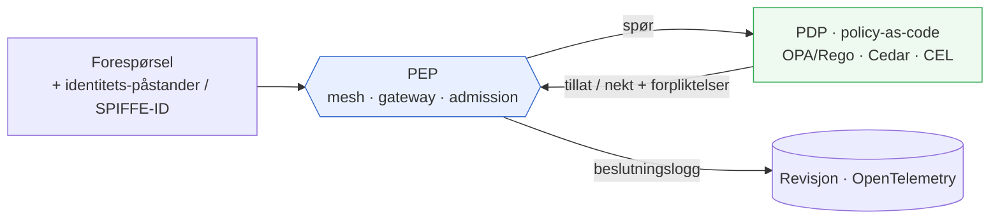

*PDP-en identifiserer ingenting og PEP-en bestemmer ingenting: det skillet er
det som lar én Rego-policy være styringsregelen på hver plattform. En policy
er bare så god som testene og inndataene sine; beslutningslogging gjør den
reviderbar.*

## 28. Fler-sky-koblingspunkter: de leverandørnøytrale skjøtene

▶ **Enkelt forklart:** en virksomhet lever sjelden på én sky. Hvis styring er
koblet med hver skys proprietære knapper, må den bygges på nytt, og vil drifte,
på neste sky. Utveien er å koble på de åpne standardene hver sky allerede
snakker, og behandle hver skys native tjeneste som en *adapter*.

▷ **I dybden.** CLAIM-COUPLE-001 koder dette som en fail-closed kryssreferanse:
på tvers av **4** skyer (AWS, Azure, GCP, OpenShift) og **6**
koblingsdimensjoner navngir alle **24** celler en konkret native mekanisme og
kobler på **13** åpne standarder. Sjekkeren håndhever egenskapen som gjør skjøten
til å stole på: **hver dimensjon er forankret av minst én åpen standard delt på
tvers av to eller flere skyer**, så portabilitet er verifisert, ikke påstått.

| Koblingsdimensjon | AWS | Azure | GCP | OpenShift | Portabel skjøt |
|---|---|---|---|---|---|
| Arbeidslast-identitetsføderasjon | STS AssumeRoleWithWebIdentity · IAM Roles Anywhere · IRSA | Entra Workload Identity Federation · Managed Identities | Workload Identity Federation | SA projected tokens (OIDC-utsteder) | OIDC · RFC 8693 · JWT |
| Menneskelig autentisering | IAM Identity Center · Cognito | Microsoft Entra ID | Cloud Identity | OpenShift OAuth-server | OIDC · OAuth2 · SAML2 · SCIM2 |
| Autorisasjonspolicy | IAM/SCP · Verified Permissions (Cedar) · Gatekeeper | Azure Policy · Gatekeeper på AKS | IAM Conditions (CEL) · Org Policy · Gatekeeper | K8s RBAC · Gatekeeper · Kyverno | Rego/OPA · Cedar · CEL |
| Hemmelighetshåndtering | Secrets Manager · Parameter Store | Key Vault | Secret Manager | Secrets + CSI-driver · cert-manager | OIDC · mTLS/X.509 |
| Observabilitet & revisjon | CloudTrail · ADOT | Azure Monitor · Activity Log | Cloud Audit Logs | K8s audit · OTel Operator | OpenTelemetry · CloudEvents |
| Tjeneste-til-tjeneste-mTLS | Private CA · App Mesh | Istio/OSM på AKS | CA Service · Anthos SM | Service Mesh (Istio) · cert-manager | mTLS/X.509 · SPIFFE |

De tretten åpne standardene, hver bevart hash-låst som litteratur under
CLAIM-COUPLE-001:

| # | Standard | Koblingsrolle |
|---|---|---|
| 1 | OpenID Connect Core 1.0 | Føderert identitet via signerte ID-tokens |
| 2 | OAuth 2.0 (RFC 6749) | Delegert autorisasjon |
| 3 | OAuth 2.0 Token Exchange (RFC 8693) | STS-stil arbeidslast-føderasjon |
| 4 | SAML 2.0 | SSO-assertions for virksomheter |
| 5 | SCIM 2.0 (RFC 7643/7644) | Provisjonering på tvers av domener |
| 6 | JWT (RFC 7519) | Signert, verifiserbart påstandstoken |
| 7 | mTLS / X.509 (RFC 8705) | Gjensidig-TLS klientidentitet, bundne tokens |
| 8 | SPIFFE/SPIRE | Portabel arbeidslast-identitet (SVID) |
| 9 | Open Policy Agent / Rego | Portabel policy-as-code |
| 10 | Cedar | Analyserbart autorisasjonsspråk |
| 11 | CEL | Portable betingelsesuttrykk |
| 12 | OpenTelemetry | Leverandørnøytral telemetri & revisjonseksport |
| 13 | CloudEvents | Portabel hendelseskonvolutt |

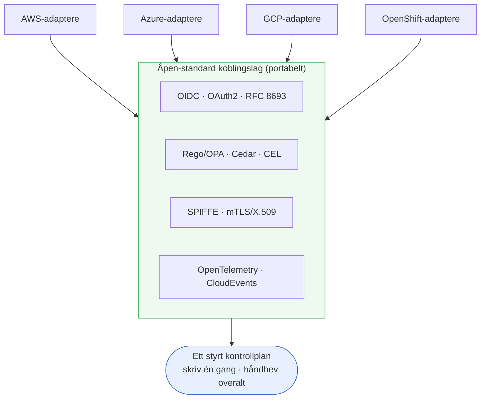

**Hva dette er og ikke er.** Det er et arkitektur-sporbarhetshjelpemiddel over
offentlig dokumenterte mekanismer: ikke en sikkerhets-designgjennomgang, ikke
en sertifisering, og ikke bevis for at en gitt utrulling er riktig konfigurert.
Native tjenestenavn er gjeldende ved skrivetidspunkt; skyer omdøper og legger
til tjenester. Den sjekkbare egenskapen er intern fullstendighet og
standard-deling på tvers av skyer; standardene er autoriteten. Brukt ærlig er
det det konkrete svaret på leverandøruavhengighets-kravet i §18-§19: samme
styring, beviselig portabel.

---
---

# Del VIII: Sikkerhetsdrift og databeskyttelse

> Styring navngir løftet; sikkerhetsdrift *holder* det, dag for dag. Denne
> delen gir hvert kontrollmål et driftsmessig hjem og behandler persondata som
> en førsteklasses fare. Tallene er verifisert av **CLAIM-SECOPS-001**
> (`governance/security_operations.py` i påstandsbiblioteket); standardene er
> bevart hash-låst som litteratur.

## 29. Sikkerhetsdrift: å holde løftet

▶ **Enkelt forklart:** et kontrollmål som «vi logger alt» eller «vi oppdager
hendelser» er bare ekte hvis noen faktisk *kjører* driften bak det, hver dag,
mot en anerkjent standard. Denne seksjonen kobler hvert driftsdomene
(tjenestestyring, observabilitet, logging, sårbarhetshåndtering, deteksjon,
hemmeligheter, robusthet) til praksisene og standardene som holder det.

▷ **I dybden.** CLAIM-SECOPS-001 koder en fail-closed dekningskryssreferanse:
**8** driftsdomener navngir **33** konkrete praksiser kjørt mot **13** offentlige
standarder, og sjekkeren verifiserer at hvert *driftsmessige* kontrollmål har
minst ett domene som holder det, så «logging & sporbarhet» er ikke en setning i
en policy, men en loggstyrings-praksis mot NIST SP 800-92, og «overvåking &
etter-marked» er observabilitet mot NIST SP 800-137 pluss deteksjon kartlagt mot
MITRE ATT&CK.

| Domene | Nøkkelpraksiser | Standarder | Holder mål |
|---|---|---|---|
| IT-tjenestestyring (ITSM) | Hendelse · endring · problem · SLM | ISO/IEC 20000-1 · ITIL 4 · NIST SP 800-61 | Accountability · monitoring |
| Observabilitet | Metrikker · tracing · SLO-er · driftdeteksjon | OpenTelemetry · NIST SP 800-137 | Monitoring · robustness |
| Logging & revisjon | Sentrale logger · tamper-evident spor · retensjon · tidssync | NIST SP 800-92 · ISO/IEC 27001 · OpenTelemetry | Logging & traceability |
| PII databeskyttelse | Oppdagelse · skrubbing · minimering · DSAR | ISO/IEC 27701 · GDPR · NIST SP 800-53 | Privacy · datastyring |
| Sårbarhetshåndtering | Skanning · patch-SLA-er · SBOM · pentest | CIS Controls v8 · OWASP ASVS · NIST SP 800-53 | Robustness · risk |
| Deteksjon & respons | SIEM-deteksjoner · SOAR · IR-øvelser | MITRE ATT&CK · NIST SP 800-61 · CIS v8 | Monitoring · human oversight |
| Hemmeligheter & nøkler | Rotasjon · HSM-nøkler · kortlevde creds | NIST SP 800-53 · CIS v8 | Robustness · accountability |
| Robusthet & backup/DR | Immutable backups · restore-testing · RTO/RPO | ISO/IEC 27001 · NIST SP 800-53 | Robustness · risk |

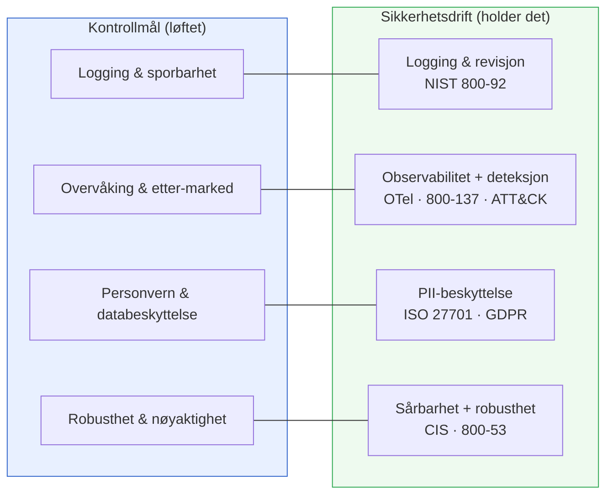

*Fire mål (transparens, menneskelig tilsyn, rettferdighet og ansvarlighet) er
styrings- og avslørings-temaer eid av kontrollregisteret (§15), ikke driftsdomener;
kryssreferansen oppgir den utelatelsen eksplisitt i stedet for å late som om
hvert mål er en driftsoppgave.*

## 30. PII-skrubbing og databeskyttelse

▶ **Enkelt forklart:** persondata er radioaktivt: nyttig, men farlig hvis det
lekker inn i logger, prompter eller en modells minne. Behandle det som en fare
med sin egen pipeline: finn det, fjern eller masker det før det lagres eller
sendes til en modell, behold kun det du må, og respekter folks rettigheter over
det.

▷ **I dybden.** For et AI-system kommer PII inn via prompter, hentet kontekst og
logger: tre flater et tradisjonelt databeskyttelsesprogram ofte overser. En
forsvarlig pipeline kjører, i rekkefølge: **oppdagelse og klassifisering** (vit
hvor PII er), **skrubbing/redaksjon eller pseudonymisering** før lagring eller
modell-input, **minimering og retensjon** (behold minst mulig, kortest mulig),
og **den registrertes rettigheter** (DSAR, sletting). ISO/IEC 27701 utvider et
ISO 27001-ISMS til et personverns-styringssystem kartlagt mot **GDPR**; NIST SP
800-53 leverer de detaljerte personvern-kontrollene.

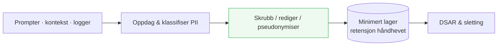

*Redaksjon er best-effort og må testes mot realistiske data; pseudonymisering er
ikke anonymisering, og telemetri/logger er en vanlig lekkasjevei (§29s
loggingsdomene og dette deler ansvar). Den ærlige holdningen: minimer det du
samler inn slik at skrubbe-pipelinen har mindre å fange.*

---
---

# Appendikser

## Appendiks A: kolleksjonsindeks

180 kanon-verk over 15 kolleksjoner [CLAIM-LIB-RAG-001]:

| # | Kolleksjon | Verk |
|---|---|---|
| 01 | Usikkerhet og ruting | 13 |
| 02 | LLM- og agent-arkitekturer | 19 |
| 03 | Evaluering og kalibrering | 11 |
| 04 | Agent-sikkerhet | 12 |
| 05 | AI-styring | 18 |
| 06 | MLOps og enterprise-arkitektur | 13 |
| 07 | Proveniens og supply chain | 12 |
| 08 | Formelle metoder | 7 |
| 09 | Rettferdighet, personvern og menneskelig innvirkning | 9 |
| 10 | Assurance-saker og runtime-verifisering | 3 |
| 11 | ML-trening og systemer | 14 |
| 12 | Programvareteknikk og SaaS | 10 |
| 13 | Marketing og vekst | 5 |
| 14 | Finans | 6 |
| 15 | Frontier-resonnering og AGI | 28 |

## Appendiks B: indeks over verifiserte teoremer

Maskinsjekkede byggesteiner (påstandsbiblioteket, `machine_checked` med mindre
annet er oppgitt), gruppert etter familie:

- **Usikkerhet:** konform kombinatorikk [THM-CONF-001..004]; runtime-
  demonstrasjon [DEMO-001, benchmarked].
- **Verifiser-amplifikasjon:** best-of-n-identitet [THM-VOTE-001]; flertalls-
  amplifikasjon + ærlig degradering [THM-VOTE-002]; verifiseringsport-styrt
  kaskade-dominans, 87 380 tabeller [THM-ROUTE-001].
- **Beslutningsteori:** Brier-properness [THM-SCORE-001]; sekretær-stopping
  [THM-STOP-001]; minimax=maximin, 6561 spill [THM-GAME-001]; Jensen/varians
  [THM-JENSEN-001].
- **Klassiske fundamenter (utvalg):** Chernoff-Hoeffding [THM-CH-001];
  CLT-demonstrasjon [THM-CLT-001, benchmarked]; Johnson-Lindenstrauss
  [THM-JL-001]; KKT [THM-KKT-001]; maks-flyt/min-snitt [THM-MFMC-001];
  no-free-lunch [THM-NFL-001]; universell approksimasjon [THM-UAT-001];
  VC-dimensjon [THM-VC-001]; Bayes/posterior [THM-BAYES-001, THM-POST-001];
  Lean-verifisert sett [THM-LEAN-001..003].

Eksakt grad og omfang står i hver påstands registeroppføring; tallene over er
uttømmende-sjekk-størrelsene registrert i evidensartefaktene.

## Appendiks C: kryssreferansematrisen

Dekning av de 10 kontrollmålene av de 5 rammeverkene [CLAIM-GOV-001]:

| Mål | AI RMF | CSF 2.0 | EU AI Act | ISO 42001 | Privacy |
|---|---|---|---|---|---|
| Styring & ansvar | GOVERN | GOVERN | - | kontekst/ledelse/støtte | GOVERN-P |
| Risikostyring | GOVERN/MAP/MANAGE | IDENTIFY | risk-mgmt-system | planlegging | - |
| Datastyring | MAP | IDENTIFY | data-governance | - | IDENTIFY-P |
| Transparens & dokumentasjon | MAP | - | tech-doc/transparency | - | COMMUNICATE-P |
| Menneskelig tilsyn | MANAGE | - | human-oversight | drift | - |
| Robusthet & nøyaktighet | MEASURE | PROTECT | accuracy/robustness | drift | - |
| Logging & sporbarhet | - | DETECT | record-keeping | - | - |
| Overvåking & post-market | MEASURE/MANAGE | DETECT/RESPOND/RECOVER | - | perf-eval/improvement | - |
| Rettferdighet & ikke-diskriminering | MEASURE | - | data-governance | - | - |
| Personvern & databeskyttelse | - | PROTECT | - | - | IDENTIFY-P/CONTROL-P/PROTECT-P |

Verifisert: 29 elementer, 42 kanter, ingen foreldreløse elementer, ingen udekte
mål, hvert mål dekket av ≥2 rammeverk, sjekket fail-closed [CLAIM-GOV-001].

## Appendiks D: ordliste

- **Påstand**: en kontrakt mellom et oppgitt faktum og en committed artefakt,
  sjekket av porten.
- **Evidensnivå**: ærlighetstrinnet en påstand har fortjent: theoretical <
  measured < benchmarked < reproduced < machine_checked < externally_validated.
- **Fail-closed**: standarden ved enhver ukjent input er nekt/avslå.
- **Kontrollmål**: ett av de 10 delte temaene [CLAIM-GOV-001].
- **Kanon**: den hash-låste litteraturkatalogen (180 verk) servert som RAG.
- **Hovedbok / vitne**: den append-only, hash-kjedede offentlige posten over
  hver bibliotek-påstand; uavhengig verifiserbar.
- **Byggestein**: en gjenbrukbar, forhåndsverifisert påstand + kode, konsumert via
  `import_bundle` / `use_code` med nivå og forbehold intakt.
- **PDP / PEP**: Policy Decision Point / Policy Enforcement Point; den
  fail-closede porten i handlings-stien.
- **TOGAF ADM**: Architecture Development Method; fasesyklusen denne håndboken
  avbilder byggesteinene på (§17).

## Appendiks E: hurtigreferanse for påstands-IDer

| ID | Hva den etablerer | Nivå |
|---|---|---|
| CLAIM-LIB-RAG-001 | 180 kanon-verk / 15 kolleksjoner / 171 verifisert / 9 drops | measured |
| CLAIM-LIB-RAG-002 | 9805 innholdsadresserte chunks, alle pushet live | measured |
| CLAIM-LIB-RAG-003 | live forsknings-endepunkter verifisert ende-til-ende | measured |
| CLAIM-GOV-001 | 5 rammeverk → 10 mål, full dekning, fail-closed | measured |
| CLAIM-COUPLE-001 | 4 skyer × 6 koblingsdimensjoner → 13 åpne standarder, hver skjøt leverandørnøytral, fail-closed | measured |
| CLAIM-SECOPS-001 | 8 sikkerhetsdrift-domener × 33 praksiser → 13 standarder, hvert driftsmål har et hjem, fail-closed | measured |
| THM-SCORE-001 | Brier-properness: ærlighet er optimalt (1028 par) | machine_checked |
| THM-ROUTE-001 | verifiseringsport-styrt kaskade-dominans (87 380 tabeller) | machine_checked |
| THM-VOTE-001/002 | best-of-n-identitet; amplifikasjon + ærlig degradering | machine_checked |
| THM-GAME-001 | minimax=maximin (6561 spill) | machine_checked |
| THM-STOP-001 | sekretær optimal stopping (n ≤ 20) | machine_checked |
| THM-JENSEN-001 | varians ≥ 0 (Jensen) | machine_checked |
| THM-CONF-001 | konform dekningskombinatorikk | machine_checked |
| DEMO-001 | konform runtime-demo (373/400, 0,9325 mot 0,9) | benchmarked |
| REMORA CLAIM-001 | 0,0 % usikker på 700-oppgaver (Wilson [0,00 %, 0,55 %]) | benchmarked |
| REMORA CLAIM-002 | 208/208 AgentHarm blokkert, FAR 0,0 % | externally_validated |
| REMORA CLAIM-009 | AROMER negativ: 43,0 %→30,7 % FA under nøytral metadata | benchmarked |

## Appendiks F: leseløyper etter rolle

- **Regulator / revisor:** §13 → §14 → §15 → Appendiks C → §24.
- **Enterprise-arkitekt:** §16 → §17 → §18 → §19.
- **Forsker / bygger:** §3 → §§8-11 → §12 → Appendiks B.
- **Nykommer:** §2 → §3 (kun de enkle linjene) → §7 → §23, følg så nysgjerrigheten.
- **Leder:** §1 → §23 → §24 (fem minutter, hele tesen og dens perimeter).

---

*Kompilert som en VeriClaim-syntese / håndbok. Hver sitering løses opp mot en
registrert, portverifisert påstand eller et hash-låst kanon-verk; registrene er
autoritative. Påstandsbasert programmering (Claim-Oriented Programming) og
VeriClaim av Stian Skogbrott.*
