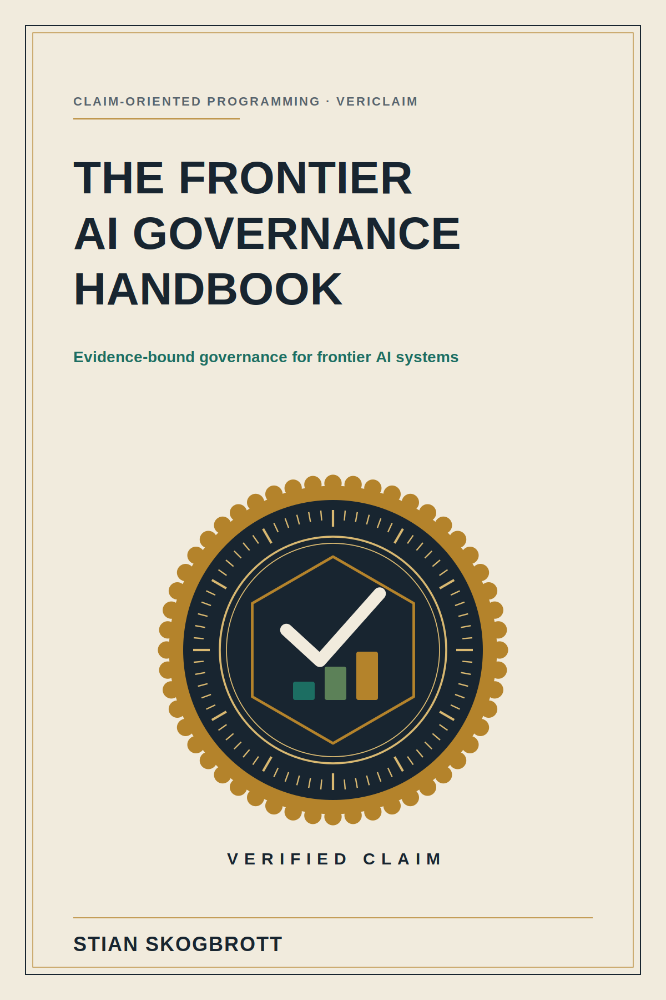

---
---

# The Frontier AI Governance Handbook

### Evidence-bound governance for frontier AI systems: print edition

*Claim-Oriented Programming and VeriClaim by Stian Skogbrott.*

---

*An AI agent is about to act in the world: read a record, send a message, run a
command. Someone signed off on letting it. Now a reviewer asks the only question
that matters: "What did you actually know when you allowed that?" If the answer
is a policy document that says the right things, you have reassurance. If the
answer is a claim, bound to evidence, at a stated level of confidence, with its
limits written down, you have a case. This book is about the difference, and
about how to build governance that can be attacked and still stand.*

---

## Preface: what this book is, and is not

**Who it is for.** Technical AI-governance practitioners, security and enterprise
architects, MLOps and AI-platform teams, and the regulatory advisors who work
with them. A reader comfortable with software delivery will be at home; a reader
new to AI/ML will find the core ideas explained from first principles, though
some chapters go deep.

**What it promises.** One idea, argued thoroughly and demonstrated: that AI
governance can be built as a system of *checkable claims* rather than a stack of
reassuring documents, and that when it is, an auditor gets a stronger position,
because the claims can be attacked mechanically and shown to hold.

**What it does not promise.** It is not legal advice, not a certification, and
not a guarantee that any particular system is safe or compliant. It is careful,
throughout, to state the limit of each claim. Part VI ("Honesty") exists to say
plainly what the method does *not* prove. If you remember one thing, remember
that the book applies its own discipline to itself: every strong statement here
is a registered claim at a stated evidence level, not a slogan.

**How to read it.** The next two pages are a one-page primer and a terminology
note. Read them first. After that, Parts I to III build the method and its
knowledge base; Parts IV to V put it into enterprise architecture and practice;
Part VI states the limits; Parts VII to VIII cover identity/policy across clouds and
security operations. The appendices are reference material. Five worked case
studies at the back show the method end to end; a hurried reader can start
there.

---

## Read this first: VeriClaim in one page

**The problem.** A governance document can say "monitored for drift" whether or
not anything monitors anything. A reader cannot tell a diligent program from a
cosmetic one, because both read the same. Confidence is not evidence.

**The idea.** Treat every factual statement a system makes about itself as a
**claim** (a contract between what is said and evidence on disk), and refuse to
write a claim you cannot back. Five words carry the method:

- **Claim.** A one-line statement with a stated evidence level and a caveat
  (its scope and limitation). *"The gate blocked all 208 adversarial scenarios,
  externally validated, but only on that benchmark."*
- **Artifact.** The committed file that establishes the claim, such as a benchmark
  result, a proof object, a checker's output. No number without an artifact.
- **Register.** The list of all claims. The single source of truth; when a
  document and the register disagree, the register wins.
- **Gate.** An automated check, run on every change, that fails the build if a
  claim drifts from its artifact, a document states a number the register does
  not back, or a claim is described above the evidence it has earned.
- **Fail-closed.** When in doubt, the gate refuses. A malformed register does
  not silently pass as "zero claims"; it stops the build. Safety is the default.

**What it buys, precisely.** Internal consistency and reproducibility: the
numbers are present where claimed, and still reproduce today. **What it does not
buy:** proof that a benchmark is realistic, that evidence was not manipulated
before it was committed, or that a sentence of prose is true. The gate proves
the *number* is bound to its evidence, not that the surrounding story is right.
Knowing that boundary is what makes the method honest.

**The evidence ladder.** Claims are graded, weakest to strongest:

> theoretical  <  measured  <  benchmarked  <  reproduced  <  machine-checked  <  externally-validated

A claim is described only at the level it has earned. Demotion is always allowed;
promotion needs new evidence. This ladder is the book's most portable idea: you
can adopt it without adopting anything else.

---

## A note on terminology

This book grew from a working system, and it names its parts. To keep the main
text readable, here is the vocabulary once, plainly:

- **VeriClaim.** The tool that implements the method: the register format, the
  gate, and the reproduce step.
- **Claim-Oriented Programming (COP).** The practice of designing by claims,
  the way Design by Contract designs by pre/post-conditions, lifted from single
  functions to a whole project.
- **Gate / reproduce.** The side-effect-free check (gate) and the step that
  re-runs each evidence script to confirm a number still holds (reproduce).
- **Ledger / witness.** An append-only, hash-chained history of claims (the
  ledger) and the act of recording a tamper-evident checkpoint of it (a witness).
- **Claims library.** A shared catalogue of reusable, evidence-bound building
  blocks that projects can search and vendor.
- **REMORA / AROMER.** A research programme on *runtime enforcement*: a
  fail-closed policy layer that blocks unsafe agent actions (REMORA) and an
  honest negative result about its limits under neutral metadata (AROMER). When
  the book cites their findings, it cites them as evidence with stated scope.
- **Cloudflare truth layer / RAG / MCP.** An optional hosted service that
  mirrors the register into a searchable, tamper-evident form; retrieval-
  augmented generation (RAG) over that corpus; and the tool protocol (MCP) an
  assistant uses to query it. Everything in the book works without it.

**Claim identifiers** (like `CLAIM-GOV-001` or `THM-SCORE-001`) appear in
brackets after the statements they support. Treat them as footnote markers: each
points to a row in the appendix where the exact evidence level, scope and
artifact live. You can read straight past them; they are there so a skeptic can
check.

---

## A note on the strength of the claims

This book argues its thesis firmly. In a work about *not overclaiming*, that
deserves a word. Two commitments keep the firmness honest. First, the strong
statements are comparative and mechanism-based, not absolute: falsifiable
governance is stronger *as an audit position*, because its claims can be attacked
mechanically and fail to break, not "better" in some unmeasured, general sense.
Second, each headline finding is itself a registered claim at a stated evidence
level, with its caveat attached; where the evidence is a demonstration rather
than a field result, the text says so. Read the strong sentences as invitations
to check, not as conclusions to accept.
